---
format:
  pdf:
    include-before-body:
      text: |
        \begin{titlepage}
        \raggedleft
        \vspace*{0.5cm}
        
        {\Huge\bfseries Kandidatuppsats\par}
        \vspace{0.5cm}
        
        {\Large Statistiska Institutionen\par}
        \vspace{3cm}
        
        {\Huge\bfseries Nr 2026:x\par}
        \vspace{0.5cm}
        
        {\LARGE \bfseries Title in English\par}

        {\large Title in Swedish\par}
        \vspace{0.5cm}
        
        {\large \today\par}
        \vspace{3cm}
        
        {\Huge Charlotte Emily Iszatt \& Milou Rossi\par}
        \vspace{0.1cm}
        
        {\footnotesize for the Alzheimer's Disease Neuroimaging Initiative*}
        \vspace{0.5cm}
        
        {\footnotesize *Data used in preparation of this article were obtained from the Alzheimer's Disease Neuroimaging Initiative (ADNI) database (adni.loni.usc.edu). As such, the investigators within the ADNI contributed to the design and implementation of ADNI and/or provided data but did not participate in the analysis or writing of this report. A complete listing of ADNI investigators can be found at: $http://adni.loni.usc.edu/wp-content/upload/how\_to\_apply/ADNI\_Acknowledgement\_List.pdf$}

        \vfill
        
        \end{titlepage}
        
        \begin{titlepage}
        \raggedleft
        
        {\normalsize Självständigt arbete 15 högskolepoäng inom Statistik III, VT2026\par}
        {\normalsize Handledare: Hans Nyqvist\par}
        \vspace{2cm}
        
        \raggedright
        {\huge\bfseries Abstract\par}
        \vspace{1cm}
        
        {\Large The abstract text can go here. The abstract text can go here. The abstract text can go here. The abstract text can go here. The abstract text can go here. The abstract text can go here. The abstract text can go here. The abstract text can go here. The abstract text can go here. The abstract text can go here. The abstract text can go here. The abstract text can go here. The abstract text can go here. The abstract text can go here. The abstract text can go here. The abstract text can go here. Keywords: XXX, XXX, XXX\par}
        \vspace{3cm}
        {\footnotesize Data collection and sharing for the Alzheimer's Disease Neuroimaging Initiative (ADNI) is funded by the National Institute on Aging (National Institutes of Health Grant U19AG024904). The grantee organization is the Northern California Institute for Research and Education. In the past, ADNI has also received funding from the National Institute of Biomedical Imaging and Bioengineering, the Canadian Institutes of Health Research, and private sector contributions through the Foundation for the National Institutes of Health (FNIH) including generous contributions from the following: AbbVie, Alzheimer’s Association; Alzheimer’s Drug Discovery Foundation; Araclon Biotech; BioClinica, Inc.; Biogen; Bristol-Myers Squibb Company; CereSpir, Inc.; Cogstate; Eisai Inc.; Elan Pharmaceuticals, Inc.; Eli Lilly and Company; EuroImmun; F. Hoffmann-La Roche Ltd and its affiliated company Genentech, Inc.; Fujirebio; GE Healthcare; IXICO Ltd.; Janssen Alzheimer Immunotherapy Research \& Development, LLC.; Johnson \& Johnson Pharmaceutical Research \& Development LLC.; Lumosity; Lundbeck; Merck \& Co., Inc.; Meso Scale Diagnostics, LLC.; NeuroRx Research; Neurotrack Technologies; Novartis Pharmaceuticals Corporation; Pfizer Inc.; Piramal Imaging; Servier; Takeda Pharmaceutical Company; and Transition Therapeutics.}
        
        
        \vfill
        
        \end{titlepage}
    toc: false
    colorlinks: false
    number-sections: true
    fig-pos: "H"
    tbl-pos: "H"     
editor: visual
---

```{=latex}
\tableofcontents

\newpage
```

```{r setup, include=FALSE}
knitr::opts_chunk$set(echo = FALSE)
knitr::opts_chunk$set(warnings = FALSE)
knitr::opts_chunk$set(message = FALSE)
options(knitr.table.format = "latex")
knitr::opts_chunk$set(tab.pos = "H")
```

```{r}
# set-up for tables
kable_standard <- function(df, caption = NULL, ...) {
  kable(df, booktabs = TRUE, caption = caption, ...) %>%
    kable_styling(
      latex_options = c("hold_position", "scale_down"),
      full_width = FALSE
    )
}
```

```{r}
library(dplyr)
library(kableExtra)
```

# Introduction

## Background

According to the World Health Organization (2025), Alzheimer's disease (AD) is the most common neurodegenerative disorder and a leading cause of dementia around the world with no definitive cure (WHO, 2025). The 2011 National Institute on Aging-Alzheimer’s Association (NIA-AA) diagnostic guidelines describe the disease as a continuum with three stages: a symptom-free stage (pre-clinical AD), a pre-dementia stage (mild cognitive impairment (MCI) due to AD) and a dementia stage (dementia due to AD) (Carrillo et al. 2013, p. 596). Pathophysiological changes due to AD can begin up to 20 years before clinical symptoms appear, highlighting the crucial importance of early diagnosis and timely intervention to potentially slow the progression of the disease (Carrillo et al., p. 595).

In the context of AD the term "biomarker" is commonly used and is defined as "a characteristic that is objectively measured and evaluated as an indicator of normal biological processes, pathogenic processes, or pharmacologic responses to a therapeutic intervention." (Biomarkers Definitions Working Group, 2001, p. 91).

AD pathophysiology has typically been detected by positron emission topography (PET) to confirm the presence and degree of amyloid plaques in the brain or by quantification of biomarkers implicated in AD pathology in cerbrospinal fluid (CSF) (Mattsson et al., 2017, p. 557). The former method involves radiation and the latter requires a lumbar puncture in order to extract the CSF. WHO published a report in 2024 highlighting the promising progress made in recent years regarding the use of blood-based biomarkers to support AD diagnosis (WHO, p. 6). Specifically, recent breakthroughs in technology (Rissin et al., 2010) have allowed for quantification of biomarkers at much smaller concentrations than previous methods, typically being up to 1000 times more sensitive (Chang et al., 2012, p. 2). Using this method, biomarkers can be detected peripherally from their origin where concentrations are much smaller. These advances mean that more invasive procedures can be substituted with blood tests.

There are several core biomarkers used in the diagnosis and staging of AD (Jack et al., 2024), such as tau protein phosphorylated at the threonine-181 position (p-tau181), with concentrations expected to be higher in individuals with AD pathology (Wong et al., 2012, p. 815). Neurofilament light chain (NfL), a marker of neuronal injury not specific to AD (Jack et al., p. 5158), is also of importance. NfL is usually present inside neurons, and therefore concentrations are expected to be higher in individuals with neuronal injury symptomatic of AD (Clark et al., 2021, p. 7). Research suggests that NfL may be used as a prognostic marker of cognitive decline which supports the diagnosis of a myriad of diseases, including frontotemporal dementia, whilst p-tau181 is more useful for differentiating AD from other neurodegenerative conditions (WHO, 2024, p. 7).

These two blood-based biomarkers, along with various other biomarkers and clinical measures related to AD, are the focus of the *Alzheimer’s Disease Neuroimaging Initiative* (ADNI), whose main goals are to provide open-access data to researchers worldwide and to improve the diagnosis of AD (ADNI, n.d.-a). Since 2004, researchers across more than 60 clinical sites in the USA and Canada have continuously collected and analyzed data throughout the different phases of the study. Blood samples from the ADNI cohort have been retrospectively analysed using the recently developed quantification method in order to measure p-tau181 and NfL concentrations (Zetterberg & Blennow, 2020; Blennow, 2018).

## Research Context

Recent research has applied a range of prognostic models to estimate disease progression and related adverse outcomes in AD using biomarker data. One study from 2020 used $log_{10}$ transformed baseline plasma p-tau181 values in a Cox proportional hazards (Cox PH) model and found it to be a strong predictor of conversion across groups, with hazard ratios ranging from approximately 2.5 to 3.8 depending on cognitive status (Janelidze et al., 2020, 388). Adjusting for age, sex and education, baseline plasma p-tau181 levels were strongly associated with increased risk of progression to Alzheimer’s dementia, with hazard ratios around 3-4 per standard deviation increase. A Cox PH model was estimated with additional $log_{10}$ transformed biomarker levels, including plasma NfL. The effect of p-tau181 remained significant, with only a small reduction in effect size, whereas NfL showed no meaningful contribution to risk prediction with hazard ratios close to 1 (Janelidze et al., pp. 385, 388).

The joint modelling framework extends the Cox PH model by linking a longitudinal model which accounts for the effect of an endogenous time-dependent covariate measured with error, such as a biomarker (Rizopoulos, 2012, p. vii). This approach has been applied to model the relationship between repeated plasma p-tau181 and NfL measurements on the conversion risk to AD (Yuan et al., 2024, p. 1). Higher longitudinal p-tau181 levels were found to be associated with a significantly increased risk of progression, with the joint model estimating a hazard ratio of approximately 5.83 for p-tau181 and 4.18 for NfL (Yuan et al., p. 1). Combining p-tau181 and NfL measuremetns in a multivariate joint model lead to improved performance (Yuan et al., pp. 1, 3). Several studies have examined the association between plasma p-tau181 and NfL levels and baseline measures such as cognition score or CSF biomarker levels using longitudinal models (Mattsson et al., 2019; Chen et al., 2021).

The simultaneous modelling of multivariate longitudinal biomarkers and clinical endpoints when heterogeneity is highly suspected has been handled by joint latent class mixed models (JLCMMs) (Proust-Lima et al., 2023, p. 3996). JLCMMs model complex disease progression whilst offering a method for the exploration of new pathological hypotheses and identification of subphenotypes. One application of a multi-dimensional JLCMM captured heterogeneity in the trajectories of three cognitive domains (memory, language, and executive functioning) from the time of Alzheimer’s dementia diagnosis (Scollard et al., 2026, p. 383). They identified five latent classes differentiated by overall level of impairment (low-high) and rate of decline (slow-fast). Within each latent class, the pattern of decline was relatively consistent across cognitive domains, suggesting parallel deterioration across functions rather than domain-specific divergence. In addition, class membership was associated with several key variables, such as APOE genotype, sex, race, education and neuropathological burden (Scollard et al., p. 383). Despite these advances, such modeling approaches have rarely been applied to longitudinal plasma biomarkers in AD research.

Various models have utilised longitudinal p-tau181 and NfL values to model AD progression; however, it remains unclear which approach yields the highest predictive performance. A 2025 study comparing statistical approaches for mortality risk prediction in peritoneal dialysis patients evaluated Cox proportional hazards models with baseline, time-averaged, and time-dependent biomarker values, as well as joint models (Goksuluk et al., pp. 1, 4-5). Overall, joint models demonstrated superior performance, with multivariate joint models performing slightly better than separate joint models for each biomarker (Goksuluk et al, p. 8). In AD research, however, few studies have systematically compared these modelling strategies within a unified framework, particularly for plasma biomarkers such as p-tau181 and NfL. Given these findings, an additional question is whether models based on p-tau181, NfL, or their combination provide the best prediction of progression to AD dementia.

Moreover, a common issue in modeling longitudinal biomarker data is whether to include or exclude individuals with sparse data in the analysis (Rizopoulos, pp. 27-28). The previously illustrated studies included all participants regardless of the number of measurements per individual, however this is not always the case. For example, a study examining different cognitive biomarkers to predict progression to AD included only those with at least three complete longitudinal cognitive assessments (Guo et al., 2026, p. ? ). Other studies have restricted the inclusion criteria further to those with at least ***ten longitudinal biomarker measurements in order to ensure the approximation did not lead to non-ignorable biases (Wang et al., 2024, pp. 591-592)***. Participants with cross-sectional data cannot provide information about within-subject change over time, however they still contribute useful information about between-subject variability (Fitzmaurice et al., 2011, pp. 214-215). Complete data analyses risk loss in precision dependent on the pattern and distribution of missing data across subjects and time as well as the missing data mechanism. The main concern of missing data is the potential for introducing bias, resulting in misleading inferences. Consequently, the mechanism underlying missing data is a critical consideration in longitudinal analyses, as it determines whether exclusion of incomplete cases may distort results (Fitzmaurice et al., p. 491). The handling of individuals with sparse data reflects an ongoing methodological discussion regarding how longitudinal data should be handled in practice.

## Research Aims

This study investigates the prediction of progression to AD-dementia using longitudinal blood biomarker data, comparing traditional and advanced statistical modelling approaches, different biomarker specifications, and the impact of the number of repeated measurements per individual. More specifically, the research questions are:

1.  Which modelling approach (Cox proportional hazards model with baseline biomarker values, joint models with longitudinal biomarker data, or latent class joint models) provides the best prediction of progression to Alzheimer’s disease-related dementia?
2.  Across these modelling approaches, which biomarker strategy (NfL, p-tau181, or a combination of the biomarkers) provides the best prediction of progression to Alzheimer’s disease-related dementia?
3.  How does the precision of estimated longitudinal trajectories and their associations with time to AD-related dementia vary with the number of repeated measurements per individual?

# Methodology

To address the research questions, a series of statistical models will be implemented. In all models, time to progression to AD-dementia, defined by the first recorded diagnosis of dementia, is the survival outcome. Given the relatively recent focus on blood-based biomarkers in AD research, their inclusion was considered timely and relevant. Blood-based p-tau181 and NfL were selected due to their established relevance for predicting dementia and AD progression, as well as the availability of rich longitudinal data with repeated measurements and overlapping follow-up information. In addition, they reflect two distinct pathological processes, making them suitable for comparative analyses of disease progression.

First, Cox PH models will be used to assess associations between baseline biomarker levels and progression risk. In these models, p-tau181 and NfL will be included either separately or jointly to allow comparison of their individual and combined effects. Second, joint models will be used to investigate how longitudinal biomarker trajectories are associated with the survival outcome. Initially, univariate joint models will be fitted for each biomarker separately. After that, multivariate joint models including both p-tau181 and NfL simultaneously will be applied to account for their combined and potentially correlated effects on disease progression. Finally, JLCMMs will be used to identify subgroups with distinct longitudinal biomarker trajectories and associated progression risks. As with the joint modelling approach, both univariate and multivariate latent class models will be evaluated.

All models will additionally be adjusted for baseline age, sex, and APOE-$ε4$ status. In the joint models, these covariates will be included in both submodels to account for potential confounding when estimating the association between biomarker trajectories and disease progression. The significance level will be set at 0.05 for all analyses.

Subsequently, the different modelling approaches will be compared based on their predictive performance. The same evaluation framework will also be used to compare different biomarker specifications, including p-tau181, NfL, and a combination of the two biomarkers. For prognostic models predicting progression from MCI to AD-dementia, a 2–4 year follow-up is most commonly used (Xia et al., 2025, p. 213). This reflects typical disease progression, where around one-third of individuals with MCI due to AD develop dementia within five years (Alzheimer’s Association, n.d.). Based on this, a landmark time of 1 year and prediction horizons of 2–6 years will be used to capture short- to mid-term progression. To ensure an unbiased assessment of model performance and generalisability, in-sample data is used for model development with three quarters of the sample population, whilst out-of-sample data was reserved for model evaluation with the remaining quarter.

In addition, a precision analysis will be conducted to assess whether the inclusion of individuals with space longitudinal data effects the results of the analysis. Estimates of model parameters, their precision and model stability (???) will be compared for models estimated with a cohort including at least one biomarker measurement and models with a restricted cohort including individuals with at least three measurements.

The chosen modelling approaches were based on their methodological relevance and their ability to capture different aspects of the data, providing an overview of different approaches for modelling longitudinal biomarker data and survival outcomes. They will all be applied to data from the ADNI dataset, in accordance with its data use and access policies (ADNI, n.d.-b).

# Statistical Theory

## Survival Analysis

All of the modeling approaches considered in this study are grounded in the survival analysis framework, where the primary aim is to analyze the time until a prespecified event of interest occurs. Here, time refers to the duration from baseline, defined as the beginning of follow-up, until the occurrence of the event, and the event denotes a specified outcome of interest (Kleinbaum & Klein, 2012, p. 4). In this study, the event is defined as the first dementia diagnosis, and ptau-181 and NfL levels as well as diagnosis status are available at baseline.

Additionally, individuals with AD-dementia are either considered as right-censored, meaning that they do not reach the event during the follow-up period, or as interval-censored, meaning that the exact date of the event is unknown (Kleinbaum & Klein, 2012, pp. 7, 286). This classification is due to diagnoses being made yearly, meaning that the exact date of transition to dementia can only be approximated.

## Cox Proportional Hazards Model

To quantify the association between biomarkers and disease progression, relative hazards models are commonly used. These models compare the hazard of progression between individuals with different covariate profiles, and assume that their hazard rates are proportional. The Lehmann alternative for comparing survival functions assumes that two survival functions, $S_0(t)$ and $S(t)$, are related such that:

$$S(t) = [S_0(t)]^{\psi}$$

where $\psi$ is the proportional hazards constant (Moore, 2016, pp. 43-44). This relationship can be re-expressed in terms of their hazard functions to give:

$$h(t) = \psi h_0(t)$$

which is the proportional hazards assumption (Moore, p. 55). Further, covariate information is linked to the proportional hazards constant exponentially, yielding the following model:

$$h(t) = h_0(t) exp\left\{ \mathbf{x}^T \boldsymbol{\beta} \right\}$$

where $\mathbf{x}^T$ is a vector of covariates and $\boldsymbol{\beta}$ is a vector of model parameters. In this analysis, the covariates of interest in the hazard model are age, gender, APOE-$\epsilon 4$ status and baseline p-tau181 and NfL values.

### Model Assumptions

A key assumption of this model is the assumed proportionality between hazard functions for different values of the specified covariates. This assumption is crucial for the construction of the partial likelihood, which allows the survival distribution to remain unspecified, as it allows the baseline hazard function to be dropped from the partial likelihood. At the same time, minor violations of this assumption are generally unlikely to have substantial effects on inference and parameter estimation (Moore, p. 94).

### Concordance Index

The concordance index (C index) is an evaluation measure for the performance of survival models. All pairs of individuals are selected, and the C index evaluates the proportion of pairs who are concordant, where the individual with a higher cumulative incidence, calculated as $1 - S(t)$, has the shorter time-to-event (Park et al., 2021, p. 1701). The C index will be considered as an initial evaluation metric for the different Cox PH models estimated in this analysis.

## Joint Modelling of Longitudinal and Survival Data

In the joint model of longitudinal and survival data, the hazard function at time $t$ is directly dependent on the value of the biomarker level at time $t$. In AD research, biomarkers such as p-tau181 and NfL are measured repeatedly over time, and the relationship between their trajectories and disease progression analysed.

The longitudinal process - modeled by a linear mixed-effects model - and the survival process - modeled by a proportional hazards model - are linked by a specified association structure. This structure can link the survival process to the current value of the biomarker estimate only, or include the current rate of change of the biomarker trajectory. For instance, if both the current value and current rate of change are specified in the proportional hazards model, this becomes:

$$h(t|M_i, \mathbf{v_i}) = h_0(t)exp\left\{\boldsymbol{\gamma}^T\mathbf{w}_i + \alpha_1 m_i(t) + \alpha_2 m_i'(t) \right\} \qquad m_i'(t) = \frac{d}{dt} m_i(t)$$

where $\alpha_1$ and $\alpha_2$ link the current value of the biomarker, $m_i(t)$, and the current rate of change, $m_i'(t)$, respectively to the hazard function. Further, $\boldsymbol{\gamma}^T$ is a vector of log-hazard ratios and $\mathbf{w}_i$ is a vector of time-independent covariates for the $i^{th}$ individual.

This univariate framework is applied to the longitudinal p-tau181 and NfL measurements separately to model their trajectories jointly with survival outcomes. **Multivariate joint models extend the standard joint modeling framework by allowing two or more longitudinal biomarkers to be modeled jointly while being linked to a shared survival outcome describing progression to AD or dementia. Therefore, both p-tau181 and NfL are considered simultaneously, as they capture complementary aspects of neurodegeneration and Alzheimer-related pathology.** **\*\*\* källa?** Ignoring their correlation may lead to biased estimation (Xu, 2021, p. 6)

### Linear Mixed-Effects Submodel

The longitudinal component of the joint model is specified by the linear mixed-effects (LME) model (**LAIRD & WAIRE**), which captures both population-level trends and individual variability in biomarker trajectories.

Longitudinal data consists of repeated measurements from the same individuals, whereby the assumption of independence between observations is illogical. In this analysis, the levels of p-tau181 and NfL for an individual at a specific time point, $t$, are correlated with the measurements made on prior and subsequent occasions. Therefore, the responses from an individual are expected to be more highly correlated than those between individuals. The modelling of this type of data which can be considered grouped with non-independence between observations, is handled well by LME models.

Following the notation of Rizopoulos (p. 54), the biomarker process for p-tau181 and NfL can be considered such that:

$$ y_i(t) = m_i(t) + \epsilon_i(t) \qquad \epsilon_i(t) \sim N(0, \sigma^2) $$

$$ m_i(t) = \mathbf{X_i^T}\boldsymbol{\beta} + \mathbf{Z_i}^T\mathbf{b_i} \qquad \mathbf{b_i}(t) \sim N(0, \sigma^2) $$

where $y_i(t)$ is the observed biomarker measurement at time $t$ for individual $i$. Assuming that the true biomarker value is not observed due to measurement and other errors, $m_i(t)$ then is the trajectory function which represents the true unobserved value of the biomarker at time $t$ for patient $i$. The fixed effects are described by $\mathbf{X_i}^T(t)\boldsymbol{\beta}$ and the random effects by $\mathbf{Z_i}^T\mathbf{b_i}$, where $\boldsymbol{\beta}$ are population-specific parameters and $\mathbf{b}_i$ are subject-specific parameters (Verbeke & Geert Molenberghs, 2000, p. 23). These subject-specific parameters handle the non-independence of the repeated measurements. Combining the true biomarker trajectory function with the error term gives:

$$ y_i(t) = \mathbf{X_i^T}\boldsymbol{\beta} + \mathbf{Z_i}^T\mathbf{b_i} + \epsilon_i(t) \qquad \mathbf{b_i}(t) \sim N(0, \sigma^2), \quad \epsilon_i(t) \sim N(0, \sigma^2) $$

### Survival Submodel

Assuming the survival submodel is defined as a Cox PH model, the longitudinal biomarker process is incorporated with the survival process, given a current value only association structure, such that:

$$h(t|M_i, \mathbf{v_i}) = h_0(t)exp\left\{\gamma^T\mathbf{w_i} + \alpha m_i(t) \right\} \qquad M_i = \left\{m_i,  0 \le s \le t\right\}$$

where $M_i$ represents the true unobserved biomarker profile up to time t.

### Model Assumptions

A core assumption of the joint model for longitudinal and survival data is full conditional independence between the longitudinal outcome and the survival outcome. All dependence is assumed to be explained by the random effects, resulting in independence of the longitudinal and survival outcomes and the repeated biomarker measurements are independent of each other. (**REF**)

### Estimation - Frequentist vs Bayesian Approach

The primary estimation approach that has been proposed for joint models is (semiparametric) maximum likelihood (Rizopoulos, 2012, p. 62). However, a key difficulty in joint modelling is that the estimation process can be very computationally demanding and may sometimes be infeasible (Wu et al., 2008).

A Bayesian alternative treats parameters as random variables and combines prior distributions with observed data to obtain posterior distributions, in contrast to the frequentist view where parameters are fixed but unknown (Carlin & Louis, 2008). This approach can simplify inference in complex models, and with weakly informative priors, it often yields results similar to maximum likelihood estimation (Brown & Ibrahim., 2003, p. 222).

Using the R package JMbayes, joint models can be fitted via Markov chain Monte Carlo (MCMC) algorithms (Rizopoulos, 2018). MCMC generates dependent samples from the posterior distribution using a Markov chain, where each step depends only on the current state. As the chain evolves, it converges to its stationary distribution, allowing the generated samples to be treated as representative of the posterior distribution and used for inference via Monte Carlo integration (Hamra et al., 2013, p. 628).

In Jmbayes, weakly informative ones are used, allowing stable estimation while letting the data primarily drive inference. The framework also accommodates multivariate settings, by introducing additional association parameters and regularising priors to handle higher-dimensional parameter structures (Rizopoulos, 2018).

### The Gelman-Rubin Statistic

Convergence within the framework of Bayesian joint modeling can be evaluated by running multiple chains from different starting values (Peng, 2022, chapter 7.4.2). All chains are expected to eventually reach the stationary distribution and become indistinguishable. Convergence can be assessed by comparing variation between chains to variation within chains, with small between-chain variation indicating that the chains are similar (Peng, chapter 7.4.2).

The Gelman-Rubin statistic R formalizes this idea (Peng, chapter 7.4.2). Consider $J$ Markov chains, each with samples $x_1^{(j)}, x_2^{(j)}, \dots$ from the $j$-th chain. For each chain, remove the first $D$ samples as “burn-in” and retain the following $L$ samples: $x_D^{(j)}, x_{D+1}^{(j)}, \dots, x_{D+L-1}^{(j)}$. One common choice is to set $D = L$.

Then calculate the chain mean for each chain,

$$\bar{x}_j = \frac{1}{L} \sum_{t=1}^{L} x_t^{(j)}$$

the overall mean across all chains (the grand mean),

$$\bar{x}_\cdot = \frac{1}{J} \sum_{j=1}^{J} \bar{x}_j$$

the between-chain variance,

$$B = \frac{L}{J-1} \sum_{j=1}^{J} \left(\bar{x}_j - \bar{x}_\cdot\right)^2$$

the within-chain variance for each chain,

$$s_j^2 = \frac{1}{L-1} \sum_{t=1}^{L} \left(x_t^{(j)} - \bar{x}_j\right)^2$$

and finally, the average within-chain variance,

$$W = \frac{1}{J} \sum_{j=1}^{J} s_j^2$$

Subsequently, the Gelman-Rubin statistic is:

$$R = \frac{\frac{L-1}{L} W + \frac{1}{L} B}{W}$$

As the number of iterations L increases and the between-chain variation B decreases, R approaches 1. Thus, chains are typically run until R is near 1. Being a unit-free ratio, R provides a convenient summary of convergence without requiring specification of a particular parameter, making it a practical tool for monitoring MCMC chains before any inference is made (Peng, chapter 7.4.2).

## Joint Latent Class Mixed Model

JLCMMs address suspected disease heterogenity by assuming that the sample population consists of a finite number of unobserved subgroups (latent classes), each characterized by distinct longitudinal trajectories and survival risks (Kyheng et al., 2025, p. 2). Individuals within latent classes are assumed to share longitudinal biomarker trajectories and survival risks (Proust-Lima et al., 2018, p. 5) and the classes are not described by the observed covariates (Rizopoulos, 2012, p. 122).

In this analysis, univariate JLCMMs will be fit on the longitudinal p-tau181 and NfL measurements separately to assess whether any latent classes can be distinguished, and to ascertain any differences in predictive performance of these biomarkers.

***DELETE IF WE DONT USE MULTI JLCMM: Multivariate JLCMM allowing multiple longitudinal biomarkers to be modeled simultaneously within each latent class, while linking their joint evolution to a class-specific risk.***

***, and then by compared to the multivariate model for both biomarkers,***

### Class Submodel

The JLCMM consists of three submodels; a multinomial logistic submodel, a linear mixed-effects submodel and a proportional hazards submodel. Multinomial logistic regression models classes such that:

$$\pi_{i,g} = Pr(c_i = g | \mathbf{X}_i) = \frac{e^{\mathbf{X}_i \boldsymbol{\beta}_g}}{\sum^{G}_{l = 1}e^{\mathbf{X}_i \boldsymbol{\beta}_l}}$$

where $\mathbf{X}_i$ is the set of covaritates for the $i^{th}$ individual and $\boldsymbol{\beta}_g$ is the set of coefficients for the $g^{th}$ group. Given there are no prior assumptions about the latent classes, no covariates are specified in the multinomial logistic regression model (Kyheng et al., p. 2). The class submodel then simplifies to:

$$\pi_{i,g} = Pr(c_i = g) = \frac{e^{\boldsymbol{\beta}_{0,g}}}{\sum^{G}_{l = 1}e^{\boldsymbol{\beta}_{0,l}}}$$

where $\pi_{i,g}$ is the probability that the $i^{th}$ individual belongs to latent class $g$. Linking the class submodel to the longitudinal submodel and the survival submodel, assuming only a random intercept, results in the following:

$$h(t | c_i = g) = h_{0, g}(t)exp\left\{\boldsymbol{\gamma}^T\mathbf{w}_i + \alpha_1 m_i(t) \right\} $$

### Model Assumptions

In JLCMM, the biomarker and the time-to-event are considered to be conditionally independent given the latent classes, where all correlation between repeated measures of the biomarker is handled by the random effects in the longitudinal model (Proust-Lima et al., 2018, p. 122). This is in contrast to regular joint models, where the biomarker and time-to-event are assumed to be conditionally independent given the random effects (Proust-Lima et al., p. 62-63). The conditional independence assumptions for the JLCMM are as follows;

1.  Correlations between observations of the longitudinal biomarker are modeled by the random effects, $b_i$, in the longitudinal model.

2.  The relationship between biomarker trajectory and the time-to-diagnosis is captured completely by the latent class indicator, $c_i$.

***POSSIBLY UNNECESSARY: There are various methods for assessing the conditional independence assumption, but simulations have demonstrated the superior performance of the score-test statistic in evaluating residual independence between the longitudinal and survival processes, even against two misspecified alternative hypotheses (Jacqmin-Gadda et al., 2010, p. 17).***

The score test assumes the null hypothesis of conditional independence, that is, all correlation between the biomarker trajectory and time-to-event is captured entirely by group membership. Given the class membership is known, there is assumed to be no remaining dependence between the biomarker response and the time-to-event response. Assuming a model with a current value association structure, the association parameter, $\alpha_1$, is assumed to be zero under the null hypothesis (Jacqmin-Gadda et al., p. 13), such that:

$$H_0: \alpha_1 = 0 \qquad H_A: \alpha_1 \ne 0$$

Under the null hypothesis, the score test statistic, $U$, is $\chi^2$ distributed with degrees of freedom equal to the number of shared-random effects in the model (Proust-Lima et al., p. 8). A significant test statistic supports the alternative hypothesis that there is residual dependence between the biomarker and time-to-event responses.

### Estimation

The log-likelihood for the JLCMM is much more tractable than for the regular joint model (Rizopoulos, p. 123), making estimation less computationally demanding. Log-likelihood estimation for JLCMM involves summing over the latent classes (Proust-Lima et al., 2014, p. 5), which is computationally advantageous when compared with the estimation of joint models which require mathematical approximation through, for example, the previously defined MCMC algorithm, due to integration over the random effects. For JLCMM, the log-likelihood is maximised using a **Marquardt algorithm**. In model estimation it should be considered that there may be several local maxima, meaning the algorithm should be run several times using different starting values (Proust-Lima et al., p. 5).

In the $lcmm$ package developed by Proust-Lima et al. for estimating JLCMMs, a Weibull baseline hazard model is estimated by default and it is not possible to estimate a Cox PH model, in order to stay in the full-likelihood framework (Proust-Lima et al., p. 5). Therefore, it is necessary to assess whether the hazard is best modeled by the Weibull or by a flexible baseline hazard model.

### Class Enumeration

Determining the number of latent classes (class enumeration) is one of the challenges of model selection for JLCMMs. Likelihood ratio tests cannot be performed for nested latent class models with differing number of classes, as regularity conditions which ensure a $\chi^2$ distributed test statistic do not hold (Celeux & Soromenho, 1996, p. 196). Therefore, other metrics must be utilised for this purpose.

One aspect of determining the optimal number of classes is minimization of the Bayesian Information Criterion (BIC) (**Schwarz, 1978**), which is the preferred criterion for mixture models (Proust-Lima et al., p. 7). Classes must also be adequately discriminated, which is assessed by analysis of posterior class membership probabilities, given by (Proust-Lima et al., p. 7):

$$\widehat\pi_{i,g} = P(c_i = g |Y_i, (T^*_i, E_i); \widehat\theta_G) \\
= \frac{
\widehat\pi_{i,g}f(Y_i | c_i=g; \widehat\theta_G)\lambda_i(T_i | c_i=g; \widehat\theta_G)S_i(T_i | c_i=g; \widehat\theta_G)
}
{
\sum_{l = 1}^{G} \widehat\pi_{i,l}f(Y_i | c_i=l; \widehat\theta_G)\lambda_i(T_i | c_i=l; \widehat\theta_G)S_i(T_i | c_i=l; \widehat\theta_G)}$$

Reporting the proportion of individuals who have a posterior probability over a certain threshold (Proust-Lima et al., p. 7) - typically 0.7, 0.8 or 0.9 - illustrates the ability of the model to discriminate classes from one another. Mean posterior probabilities for each class can also be reported, with $\mu(\widehat\pi_g)$ values close to 0.5 showing poor class discrimination. Class sizes are also important, as classes that are made up of less than $5\%$ of the total sample population may be driven by outliers and therefore not be clinically meaningful.

**Entropy**

One possible measure of the discriminative power of a latent class structure is relative entropy (Ramaswamy et al., 1993 in Morgan et al., 2016, p. 150), which takes values between 0 and 1 and is calculated as follows:

$$EN(G) = 1 - 
\frac{
\sum_{i = 1}^{N}\sum_{g = 1}^{G} \widehat\pi_{i,g}log(\widehat\pi_{i,g})
}
{
Nlog(G)
}$$

where $G$ is the number of latent classes specified by the model and $\widehat\pi_{i,g}$ is the posterior probability that the $i^{th}$ individual belongs to class $g$. Relative entropy values closer to 1 demonstrate good discriminative ability of the model, where, for one class latent models, $EN(1) = 1$. **\*CONEPTUALLY, WHAT DOES THIS MEASURE???\***

**Validation**

The chosen classes should be clinically meaningful.

## Evaluation of Predictive Performance

Information criteria such as the Akaike Information Criterion (AIC) are often used to evaluate predictive performance in joint models combining longitudinal and survival data. However, when the main focus is the survival outcome and how well a longitudinal biomarker predicts it, performance is typically assessed using two main approaches: calibration, which measures how closely predicted probabilities agree with observed outcomes, and discrimination, which evaluates how well the model distinguishes between individuals who experience the event earlier versus later (Rizopoulos, p. 194). Time-dependent AUC is an example of a discrimination measure, while the Brier score is a calibration-oriented measure that also reflects overall prediction error over time.

### Time-dependent AUC

ROC analysis is commonly used to evaluate the ability of a marker or model to discriminate between binary outcomes, such as diseased and non-diseased individuals (Zou et al., 2012, p. 3). However, the traditional ROC framework assumes that both disease status and marker values are fixed over time (Kamarudin et al., 2017, p. 1).

In survival settings, this assumption is often violated, as event status changes during follow-up and marker values may vary over time. To account for this, time-dependent ROC curves have been developed, incorporating the timing of events and censoring, and providing a more appropriate framework for assessing prognostic accuracy (Kamarudin et al., 2017, p. 1).

When a time-dependent framework is adopted, the disease status is evaluated at each time point, meaning that sensitivity and specificity may change over the course of the study. Let $T_i$ denote the time of disease onset for individual $i$, and let $X_i$ represent a marker value (typically measured at baseline) for individual $i$, where $i = 1, \ldots, n$ (Kamarudin et al., p. 2).

**QUESTIONS:**

1.  **When is** $Z_i$ **used after defining it?**

2.  **What is the difference between** $\delta_i$ **and** $D_i(t)$**? Does** $\delta_i$ **refer to whether the event happens at all, whereas** $D_i(t)$ **refers to whether the event has occured by time** $t$**? If they are different, where is** $\delta_i$ **referenced after being defined?**

The observed time is defined as $Z_i = \min(T_i, C_i)$, where $C_i$ is the censoring time. In addition, let $\delta_i$ be an indicator variable that takes the value 1 if the event (disease) occurs and 0 otherwise. Furthermore, let $D_i(t)$ denote the disease status at time $t$, where $D_i(t) = 1$ indicates presence of disease at time $t$, and $D_i(t) = 0$ otherwise (Kamarudin et al., p. 2).

In what follows, $X$ is referred to as a marker, although it may also represent a risk score derived from a regression model or another predictive model, including previously published scores (Kamarudin et al., 2017, p. 2).

For a given threshold $c$, the time-dependent sensitivity and specificity are defined as:

$$ Se(c,t) = P(X_i > c \mid D_i(t) = 1) $$

$$ Sp(c,t) = P(X_i \le c \mid D_i(t) = 0) $$

Based on the definitions above, the corresponding receiver operating characteristic (ROC) curve at a given time $t$, denoted by $ROC(t)$, can be constructed by plotting the time-dependent sensitivity $Se(c,t)$ against $1 - Sp(c,t)$ across all possible thresholds $c$ (Kamarudin et al., p. 2).

The time-dependent area under the curve (AUC) is then defined as:

$$ AUC(t) = \int_{-\infty}^{\infty} Se(c,t)\, d[1 - Sp(c,t)] $$

An AUC value of 1 means perfect ability to distinguish between patients with and without the condition, while an AUC of 0.5 means no discrimination at all, meaning the marker performs no better than random guessing such as flipping a coin (Rizopoulos, p. 196)

### Brier score

The Brier score can be thought of as the mean squared error of a prediction forecast. However, for survival data, the true event status cannot be known for censored individuals. Therefore, an inverse-probability-of-censoring weighting (IPCW) adjusted Brier score has been formulated to account for bias due to censoring, where those with earlier event times are over-represented, leading to underestimation of survival probabilities (Prince et al., 2025, p. 4). IPCW weights are calculated for each individual $i = 1 , ... , n_{sample}$ at each time point $t$, such that:

$$\omega_i(t) =
\frac{\mathbb{I} \left\{ T_i^*\le t, \delta_i = 1 \right\} }{G_i(T^*_i-)} +
\frac{\mathbb{I} \left\{ T_i^* > t \right\} }{G_i(t)}$$

where $G_i(t)$ is the censoring survival function, which quantifies the probability of surviving a censoring event for the $i^{th}$ individual, $T_i^* -$ is a time point infinitesimally smaller than the observed time $T_i^*$, and $\mathbb{I} \left\{ \cdot \right\}$ is an indicator function (Prince et al., pp. 4 - 5). The commonly formulated Brier score:

$$\text{BS} = \frac{1}{n_{sample}}\sum_{i = 1}^{n_{sample}}(Y_i(t) - \widehat S_i(t))^2$$

where $\widehat S_i(t)$ is the predicted probability of an event for the $i^{th}$ individual at time $t$ and $Y_i(t)$ is their observed outcome at that time (Park et al., 1704), becomes then the IPCW-adjusted Brier score:

$$BS =
\frac{1}{ \tilde n(t)}\sum_{i = 1}^{n_{sample}} \left(
\frac{\widehat S_i(t)^2 \mathbb{I} \left\{ T_i^*\le t, \delta_i = 1 \right\} }{G_i T^*_i-} +
\frac{ (1 - \widehat S_i(t))^2 \mathbb{I} \left\{ T_i^* > t \right\} }{G_i(t)}
\right)$$

where $\tilde n(t)$ is the sum of the IPC weight (Prince et al., p. 6). The Brier score takes values from 0 to 1, where a score closer to 0 is given to a model with better predictive ability.

# Data

The data used in this analysis comes from the ADNI cohort under the ADNI1, ADNIGO and ADNI2 protocols. The variables of interest were all retrieved from the ADNIMERGE2 package, found in the ADNI database (ADNI, n.d.-b). In accordance with the ADNI leadership guidelines, which state that there were serious data quality concerns for individuals with a PTID in the format "381_S_10###" , checks were run to assure that no observations with these PTIDs were present in the data set (ADNI, 2026).

The inclusion criteria for this study require participants to have recorded diagnostic visits and biomarker measurements of both p-tau181 and NfL. The exclusion criteria was any individual with a baseline dementia diagnosis. This resulted in a sample size of 934 individuals with at least one biomarker measurement. This reduced to 704 when restricting the sample to participants with three or more biomarker measurements.

All missing values were removed prior to the analysis to ensure a complete-case data set and avoid bias introduced by incomplete observations.

## Variables

### Diagnosis status

The variable of primary interest represents three diagnostic states - cognitively normal (CN), mild cognitive impairment (MCI) and dementia - and was retrieved from the DXSUM data set in ADNIMERGE2. Diagnostic status is assessed over several examination dates, with the number of diagnostic exams differing depending on the baseline diagnosis.

Since the study focuses on time to incident dementia, participants are classified as either non-demented or demented for the survival analyses, without distinguishing between CN and MCI states. Diagnostic records occurring more than 50 days prior to the first biomarker measurement were excluded to maintain temporal alignment between clinical and biomarker data.

When restricting the participants to those with three or more biomarker measurements, the sample size of the in-sample data set was 528, among which 128 experienced the event of dementia, corresponding to 24.24%, while 400 individuals were censored. In the out-of-sample, there were 176 individuals, among whom 49 experienced the event of dementia, corresponding to 27.84%, while 127 individuals were censored. In comparison, extending the sample population to those with at least one biomarker measurement, the in-sample data set consisted of 701 individuals, among whom 145 experienced the event of dementia, corresponding to 20.69%, while 556 individuals were censored. The out-of-sample data set included 233 individuals, among whom 53 experienced the event of dementia, corresponding to 22.75%, while 180 individuals were censored.

### P-tau181 and NfL

P-tau181 measurements were retrieved from the UGOPTAU181 data set, which was processed by the University of Gothenburg (ADNI, n.d.-b). However, the unit of measurement is not specified in the data set documentation. NfL measurements were retrieved from the BLENNOWPLASMANFLLONG data set, processed by the Blennow Lab (ADNI, n.d.-b). The unit of measurement is not specified in the data set documentation for either p-tau181 or NfL.

Among participants with at least three biomarker measurements, p-tau181 values ranged from 0.4 to 238.3, with a median of 15.5. Similarly, NfL values ranged from 6.9 to 408.0, with a median of 36.5. The pronounced right-skewness for both biomarkers was the basis for log-transformation in order to better satisfy the assumption of normality (appendix 8.1.1 & 8.1.2). A similar right-skewed distribution was observed when including all participants with at least one biomarker measurement. Values larger than three standard deviations were analysed and it was determined that they should be retained in the analysis. It is also worth noting that the correlation between log-transformed p-tau181 and NfL was 0.34 (8.1.4), indicating a weak positive association. This suggests that the biomarkers share some common variation while largely capturing distinct biological processes. Overall, this supports the use of a multivariate joint modelling framework, as it allows their dependence to be accounted for while evaluating both their individual and combined associations with disease progression.

Biomarker examination dates ranged from 1 February 2007 to 6 June 2016, while diagnostic assessment dates spanned 29 September 2005 to 7 November 2025. Diagnoses were therefore available several years prior to the first biomarker measurements. In this analysis, baseline was defined as the first biomarker examination date, ensuring alignment of biomarker follow-up with dementia onset.

52 participants had two measurements with different values recorded on the same examination date. To ensure consistency, the mean value of these measurements was selected as the primary approach. **Sensitivity analyses showed no substantial differences in model precision: did we do this yet?.** Furthermore, discrepancies were observed between p-tau181 and NfL examination dates with the same visit code. Five cases exceeded 30 days, with differences of up to 231 days, indicating that these did not represent the same examination occasion. To address this, a common examination date was constructed using the midpoint between the two biomarker dates.

### Age

Additionally, age is included as a covariate when predicting progression to dementia, as risk of dementia is known to increase with age (Alzheimer’s Society, n.d.). The variable was retrieved from the PTDEMOG data set and was initially recorded as year of birth for each participant (ADNI, n.d.-b) which was transformed into age at baseline. Baseline age ranged from 55 to 94 years, with a median age of 74 years.

### Gender

Another covariate included when predicting progression to dementia is participants’ sex at birth, as recorded on their original birth certificate, due to reported differences in disease risk and progression between sexes. More precisely, women aged over 80 have a slightly higher chance of developing Alzheimer’s disease compared to men of the same age (Alzheimer’s Society, n.d.). This binary variable includes two categories: male and female (ADNI, n.d.-b). As for age, the variable was retrieved from the PTDEMOG dataset.

### APOE4-status

Finally, apolipoprotein-$\epsilon 4$ (APOE-$\epsilon 4$) status is included as a covariate when predicting progression to dementia, due to its well-established role as a genetic risk factor for AD. The $\epsilon 4$ allele of apolipoprotein E (APOE) increases the risk of AD, whereas the -$\epsilon 2$ allele has been shown to have a protective effect (Wong et al.). The variable was retrieved from the APOERES dataset (ADNI, n.d.-b). Initially coded numerically based on the number of $\epsilon 4$ alleles, the variable was recoded into three ordinal categories: 0 alleles (non-carriers), 1 allele (heterozygous carriers; 2/4 or 3/4), and 2 alleles (homozygous carriers; 4/4).

Among the participants with at least three biomarker measurements, 83 participants carried no APOE-$ε4$ alleles, 578 carried one allele, and 43 carried two alleles. When looking at the participants with at least one biomarker measurement, 109 of these participants carried no APOE-$ε4$ alleles, 772 carried one allele, and 53 carried two alleles.

# Results

## Model fit overview

### Test of Proportional Hazards Assumption and Concordance

To evaluate the association between biomarkers and progression to dementia due to AD, while adjusting for relevant covariates, Cox PH models were first fitted including either baseline p-tau181, baseline NfL, or both biomarkers measured at baseline, restricted to participants with three or more biomarker measurements. Additional covariates were gender, age at baseline and APOE genotype. Initially fitting the model with all levels of genotype - which denotes the specific APOE allele combination - resulted in non-siginificant coefficients for all levels. Therefore, genotype was collapsed into three levels denoting the presence of the APOE-$\epsilon 4$ allele, taking the following values: 0 alleles (non-carriers), 1 allele (heterozygous carriers; $\epsilon 2$/$\epsilon 4$ or $\epsilon 3$/$\epsilon 4$), and 2 alleles (homozygous carriers; $\epsilon 4$/$\epsilon 4$).

Prior to interpreting the estimated hazard ratios, the proportional hazards assumption was assessed for all covariates to verify that the effects remained constant over time. As the subsequent joint models also require a standard Cox PH model, this assumption was additionally evaluated for this model. The resulting p-values are presented in Appendix X.

At a 5% significance level, most covariates satisfied the proportional hazards assumption across all models, as indicated by non-significant p-values for sex, APOE-$ε4$ status, and the biomarker variables. However, age at baseline consistently showed significant p-values, indicating a violation of the assumption. The same pattern was observed for the GLOBAL test, which jointly evaluates the proportional hazards assumption across all covariates and is sensitive to covariate-specific departures from the assumption; it also yielded significant or borderline significant p-values.

Given this violation, age at baseline was excluded from the final Cox PH models. The refitted models therefore yielded the p-values presented in Table 1.

```{r, echo=FALSE}
#| tbl-cap: "P-values for the proportional hazards assumption tests after exclusion of age at baseline in the Cox PH models estimated on participants with at least three biomarker meausurements"
kable_standard(readRDS("tables/table_ph_final.rds"))
```

After excluding age at baseline, the GLOBAL test yielded p-values above the 5% significance level and therefore no longer indicates any violation of the proportional hazards assumption. The other covariates also remained non-significant, suggesting that they jointly do not exhibit systematic time-dependent effects in any of the refitted models.

Furthermore, an initial comparison of model performance by assessment of the concordance indices for all cox models was performed. The results presented in Table 3 show that the concordance index evaluates all three models similarly.

```{r, echo=FALSE}
#| tbl-cap: "Concordance indices for the fitted Cox PH models with baseline biomarker values estimated on participants with at least three biomarker meausurements"
kable_standard(readRDS("tables/c_index_table.rds"))
```

### Residual diagnostics

The evaluation of the association between biomarkers and progression to dementia due to AD, while adjusting for relevant covariates, was further extended by fitting joint models that incorporated the longitudinal trajectories of p-tau181 and NfL with the time-to-diagnosis data. For the longitudinal component, an LME model was estimated separately for p-tau181 and NfL. As for the Cox models, these models were first estimated in participants with at least three biomarker measurements.

The choice of random effects structure was limited due to the $JMBayes2$ package currently only supporting those including a random slope. Therefore, all LME models were fit with a random intercept and slope. However, models with a simple structure with only a random intercept and an extended structure including a random slope were fit using maximum likelihood estimation in order to perform likelihood ratio tests. The results show that the extended structure was a better fit for NfL, but a simpler structure would have been preferable for p-tau181 (appendix 8.2; table 12).

Plotting the residuals against the fitted values for the LME model of p-tau181 showed no clear evidence of heteroskedasticity, as shown in Appendix X. The slight deviations in the tails of the Q-Q plot, shown in Appendix X, were also not considered to be of concern. A similar pattern was observed for the LME model of NfL, where the plot of residuals against fitted values in Appendix X showed even less evidence of heteroskedasticity compared to the corresponding plot for p-tau181. The Q-Q plot for NfL in Appendix X showed similar results to those observed for p-tau181. Generalised LME models with different link functions were also fit and their residuals analysed, however none of these models demonstrated a better fit than the LME model with log-transformed data. Consequently, these were considered to provide an adequate fit to the data, suggesting that they are suitable for use within the joint modeling framework.

Thus, joint models including longitudinal measurements of p-tau181, NfL, or both biomarkers were fitted. For each model, three MCMC chains were used, with 11,000 iterations and 1,000 burn-in iterations for the simple joint models, and 20,000 iterations with 2,000 burn-in iterations for the multivariate joint model.

### Convergence

To ensure proper model convergence of the joint models, trace plots of the $α$-parameter were examined for each model, starting with those for the joint model of p-tau181, presented in Figure 1.

**Figure 1: trace plot of the** $α$**-parameter for the joint model of p-tau181 estimated on participants with at least three biomarker meausurements.**

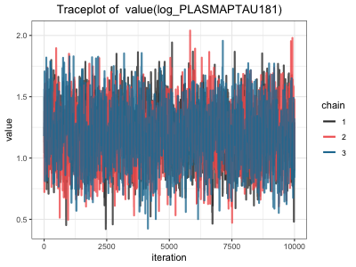{width="400"}

The trace plot shows that the three MCMC chains fluctuate around a stable mean value throughout the iterations, without any clear trend or drift. This suggests that the chains have reached a stable region. In addition, the chains overlap well and mix with each other, indicating that they are sampling from the same posterior distribution. Although some random variation is present, this is expected in MCMC sampling. Overall, the plot supports good convergence.

A similar pattern was observed for the joint model of NfL, as shown in Appendix X. The chains likewise fluctuated around a stable mean value with good mixing, indicating convergence of the $α$-parameter comparable to the joint model of p-tau181.

Finally, the multivariate joint model also exhibited a similar overall behaviour, as shown in Appendix X. Compared to the single-biomarker models, however, the trace plot for the multivariate joint model shows a slightly wider range of $α$-values, indicating a somewhat larger variability in the $α$-parameter. This suggests increased uncertainty in the parameter estimates, which is expected given the higher complexity of the model. Despite this, the chains still fluctuate around a stable mean value with no visible trend or drift, and they continue to overlap and mix well. Thus, all three models appear to have converged adequately.

Additionally, convergence of the models was assessed by examining the $\widehat{R}$ values of the survival outcome and the longitudinal outcome in each joint model, with the survival $\widehat{R}$ values presented in Table 3.

```{r, echo=FALSE}
#| tbl-cap: "$\\widehat{\\mathbf{R}}$ values of the survival outcome in the joint models"
kable_standard(readRDS("tables/rhat_survival_table.rds"))
```

The $\widehat{R}$ values for the survival outcomes are all very close to 1, ranging from 1.000 to 1.007 across all joint models. This indicates good convergence of the MCMC chains for the survival components and confirms the convergence patterns observed in the $α$-parameter trace plots, with no evidence of convergence issues.

While Table 3 presents the $\widehat{R}$ values for the survival outcomes, the corresponding $\widehat{R}$ values for the longitudinal outcomes in each joint model are shown in Table 4.

```{r, echo=FALSE}
#| tbl-cap: "$\\widehat{\\mathbf{R}}$ values of the longitudinal outcome in the joint models"
kable_standard(readRDS("tables/rhat_longitudinal_table.rds"))
```

In a similar manner, the $\widehat{R}$ values for the longitudinal outcomes are generally close to 1 across all joint models, indicating good convergence for most parameters. The intercepts and covariate effects show values very close to 1, suggesting stable convergence. However, a higher value is observed for the time effect in the multivariate model, where $\widehat{R}$ reaches 1.089. This suggests somewhat slower convergence for this parameter in the multivariate model, likely reflecting the increased complexity of the longitudinal structure. Overall, when considered together with the trace plots and survival $\widehat{R}$ values, the results still support adequate convergence of the models.

### BIC, Entropy, Posterior Classification, Score Test

The number of latent classes in the JLCMM were determined via analysis of the BIC, entropy and assessment of the posterior classifications for models with up to four latent classes. An intercept only random effects structure was chosen due to minimised BIC for all models. A Weibull baseline hazard model was chosen and checked against whether a flexible baseline hazard with the same number of parameters resulted in a lower BIC, which was the case for all models. The results were verified using the $gridsearch()$ function which allows for better exploration of the parameter space to ensure finding a global instead of a local maximum solution. This check confirmed that using random starts from the one class model was sufficient for finding the global maximum.

First, the log-likelihood, BIC and entropy of the models using longitudinal p-tau181 measurements are presented below (table 5). Log-likelihood and entropy increased with additional latent classes, however the BIC was minimised for the model with two latent classes.

```{r}
#| tbl-cap: "Log-likelihood, BIC and entropy for JLCMMs with longitudinal p-tau181 measurements"
kable_standard(readRDS("tables/summary_jlcmm_ptau.rds"))
```

Posterior classifications show the number of individuals assigned to each class, whereas the mean posterior probabilities show, for individuals in each class, the average probability of being assigned to each class. For example, values for $class1$, $prob1$ close to $1$ and $class2$, $prob1$ close to $0$ show good class discrimination.

For the two class model (table 6), the class sizes are reasonable and the mean posterior probabilities show good class discrimination, meaning the model has high certainty in assigning individuals to their respective classes. Comparison with the three class model (table 7) shows somewhat poorer class discrimination as well as a questionably small $class3$, with only $3.79\%$ of individuals being assigned to this class.

```{r}
#| tbl-cap: "Posterior classification table and mean posterior probabilities for the two class JLCMM for longitudinal p-tau181 measurements"
kable_standard(readRDS("tables/pprob_m1_ptau.rds"))
```

```{r}
#| tbl-cap: "Posterior classification table and mean posterior probabilities for the three class JLCMM for longitudinal p-tau181 measurements"
kable_standard(readRDS("tables/pprob_m2_ptau.rds"))
```

Additionally, the score test statistic for the conditional independence assumption was significant for the one class model ($50.336, p < 0.001$) but became non-significant ($0.122, p = 0.727$) upon modeling two latent classes, further evidence that the data supports two latent classes in the sample population. All model parameters were significant ($p < 0.001$) and are presented in appendix X. Therefore, the two class model was chosen for this analysis.

Analysis of the log-likelihood, BIC and entropy provided in table 8 for candidate models using longitudinal NfL data suggests that even in this instance the two class model provided the best fit for the data and had the highest classification certainty. Log-likelihood increased most between the one class and the two class model, and only increased very slightly between the two class and the three class model. BIC was minimised and entropy was maxmised for the two class model.

```{r}
#| tbl-cap: "Log-likelihood, BIC and entropy for JLCMMs with longitudinal NfL measurements"
kable_standard(readRDS("tables/summary_jlcmm_nfl.rds"))
```

Class sizes were reasonable and good class discrimination was shown when assessing the average posterior probabilities (table 9). The one class model had a significant score test statistic ($33.409, p < 0.001$) which became non-significant for the two class model ($0.368, p = 0.544$). Therefore, a two class model was again chosen.

```{r}
#| tbl-cap: "Posterior classification table and mean posterior probabilities for the two class JLCMM for longitudinal NfL measurements"
kable_standard(readRDS("tables/pprob_m1_nfl.rds"))
```

## Model comparison

In order to compare the different modelling approaches, predictive performance was evaluated using time-dependent AUC at yearly time points from 2 to 6 years of follow-up. To start with, Figure X provides an initial overview of the time-dependent AUC of the different models across the follow-up period, with the biomarker being fixed as p-tau181.

**Figure X: time-depending AUC curves for different modelling approaches (p-tau181 models)**

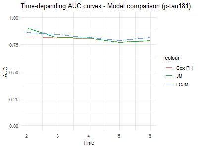{width="400"}

Among the models including p-tau181, the time-dependent AUC values remain above 0.75 across all three modelling approaches throughout the follow-up period, indicating stable and relatively strong predictive performance overall. The values are slightly higher at earlier time points, especially for the joint model. However, the differences between the models decrease over time, and at the six-year follow-up, the latent class joint model (LCJM) even yields slightly higher values compared with the other two models. The Cox PH model consistently yields the lowest AUC values.

Among the models including NfL, a similar overall pattern is observed. As shown in Appendix X, the models maintain AUC values above 0.75 throughout the follow-up period, indicating consistently strong predictive performance. At earlier follow-up times, where the values are slightly higher across models, the joint model yields the highest AUC values, once again. These values then decline over time, becoming more similar to those of the other models. Moreoever, at the six-year follow-up, the latent class joint model (LCJM) achieves the highest AUC value.

Appendix X, presenting the models including both biomarkers simultaneously, also demonstrates higher AUC values for the joint model at earlier follow-up time points. These values gradually decline over time, yielding values more similar to those of the Cox PH model at later follow-up times.

These results are also indicated by table 10, containing the AUC values for each modelling approach and at each follow-up time point.

```{r, echo=FALSE}
#| tbl-cap: "Time-dependent AUC by model and follow-up time point"
kable_standard(readRDS("tables/results_table_AUC.rds"))
```

For instance, by showing that the joint model among the p-tau181-based models has an AUC value of 0.902 at the two-year follow-up, while the Cox PH model has an AUC value of 0.823 and the latent class joint model has an AUC value of 0.862, Table X confirms the results previously observed in the figure presenting the time-dependent AUC curves for these models. The differences between the models then decrease over time; at the four-year follow-up, the AUC values are 0.802 for the Cox PH model, 0.806 for the joint model, and 0.811 for the latent class joint model.

When evaluating predictive performance using time-dependent Brier scores instead, the same overall patterns are observed, with the key difference that lower values indicate better predictive accuracy. Figure X presents the time-dependent Brier score curves for the different modelling approaches, with the biomarker specification fixed to p-tau181.

**Figure X: time-depending Brier score curves for different modelling approaches (p-tau181 models)**

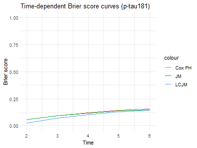{width="400"}

Among the models including p-tau181, the time-dependent Brier score values remain low, ranging from approximately 0.05 at early follow-up to 0.16 at later follow-up, across all three modelling approaches. This indicates stable and relatively strong predictive performance overall. At earlier follow-up points, however, the latent class joint model yields lower Brier score values compared with the other two models, indicating better predictive performance. The differences then become smaller at later follow-up times, where the models show similar Brier score values.

A similar overall pattern is also observed among the models including NfL: as, shown in Appendix X, the latent class joint model yields lower Brier score values compared with the other two models at earlier follow-up points. Then, at later follow-up times, these values become smaller, resulting in the differences becoming smaller between the models, with values being low, stable and around the same range as for models including p-tau181.

The same can be said for the time-depending Brier score values among the models including both biomarkers simultaneously. Appendix X demonstrates that the Cox PH model and the joint model yield similar, stable AUC values across the follow-up period, ranging from approximately 0.05 at early follow-up to 0.14 at later follow-up. Table 11 presents the Brier score values for each modelling approach and at each follow-up time point.

```{r, echo=FALSE}
#| tbl-cap: "Time-dependent Brier score by model and follow-up time point"
kable_standard(readRDS("tables/results_table_Brier.rds"))
```

For instance, at the two-year follow-up, the latent class joint model including NfL achieves the lowest Brier score, with a value of 0.024, compared with 0.053 for the joint model including NfL and 0.054 for the Cox PH model including NfL. A similar pattern is observed for the p-tau181-based models at the same time point, where the latent class joint model also yields the lowest Brier score, with a value of 0.024, compared with 0.055 for the joint model and 0.054 for the Cox PH model.

## Biomarker comparison

The predictive performance of the models was also examined in order to compare the different biomarker specifications, meaning modelling either using p-tau181, NfL or a combination of the two biomarkers. Figure X provides an initial overview of the time-dependent AUC of the models with different biomarker specifications across the follow-up period, with the model being fixed as Cox PH.

**Figure X: time-depending AUC curves for different biomarker specifications (Cox PH models)**

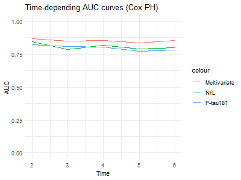{width="400"}

Within the Cox PH models, the model including NfL shows slightly higher time-dependent AUC values than the model including p-tau181 across the follow-up period, with the exception of the three-year follow-up point, where it yields a lower AUC value. However, both single-marker models are consistently outperformed by the combined model, which shows notably higher AUC values across the follow-up period.

Within the joint modelling framework, a similar overall pattern is observed. Appendix X demonstrates that the combined biomarker joint model provides the strongest predictive performance across all time points, with consistently higher AUC values than models including the biomarkers separately. Nevertheless, the NfL-based model generally shows slightly higher values than the p-tau181-based model.

Within the latent class joint models, a similar pattern is observed, as shown in Appendix X. More specifically, the latent class joint model including NfL consistently shows slightly higher AUC values than the corresponding model including p-tau181, except at the three-year follow-up time point, where this model shows a slightly higher value.

As when comparing the different modelling approaches, these results are also indicated by Table X, containing the time-dependent AUC values for each biomarker specification and at each follow-up time point. For example, at the two-year follow-up within the joint modelling framework, the combined model achieved an AUC value of 0.967, compared to an AUC value of 0.953 for the model including NfL and 0.902 for the model including p-tau181, confirming that the combined joint model provides the highest predictive performance at this time point.

However, when observing the plots of the time-dependent Brier score curves for models with different biomarker specifications, such as Figure X including the Cox PH models, the difference in predictive performance between the models is suddenly less evident.

**Figure X: time-depending Brier score curves for different biomarker specifications (Cox PH models)**

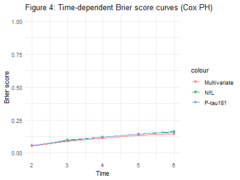{width="400"}

Within the Cox PH models, the models including p-tau181, NfL, or both biomarkers simultaneously all yield similar time-dependent Brier score values across the follow-up period. It is not until the six-year follow-up that a small difference can be observed, although this difference remains minimal. A similar pattern is also observed within the joint models, as shown in Appendix X, as well as within the latent class joint models, as shown in Appendix X.

Table X, containing the time-dependent Brier score values for each biomarker specification and at each follow-up time point, also confirms this pattern. For instance, within the Cox PH models at the two-year follow-up, all three models yield values ranging from 0.052 to 0.054, indicating minimal differences in predictive performance at this time point. At the six-year follow-up, the difference becomes slightly more pronounced: the model including both biomarkers yields a value of 0.149, while the models including p-tau181 and NfL yield values of 0.158 and 0.159, respectively.

## Precision Analysis

### Cox PH Models

As the proportional hazards assumption was met in the refitted Cox PH models, the results can be interpreted in terms of hazard ratios, which are, together with 95% confidence intervals and p-values, presented in Table 2 for the Cox PH models including either baseline p-tau181, baseline NfL, or both biomarkers measured at baseline, more specifically those estimated on participants with at least three biomarker measurements.

```{r, echo=FALSE}
#| tbl-cap: "Hazard ratios with 95% confidence intervals and p-values from the Cox PH models including baseline biomarkers estimated on participants with at least three biomarker meausurements"
 kable_standard(readRDS("tables/table_cox1.rds"))
```

Table 2 indicates that sex was not significantly associated with progression to dementia due to AD in any of the models, with all p-values exceeding 0.05. Despite non-significant coefficients for sex and non-significant likelihood ratio tests (**Appendix X**) these variables were included due to clinical relevance.

In contrast, APOE-$ε4$ status showed a strong and consistent association with progression risk, with increasing risk observed according to the number of $ε4$ alleles carried. Individuals carrying one $ε4$ allele had approximately a twofold increased hazard across models, whereas individuals carrying two $ε4$ alleles showed a substantially higher risk, corresponding to an approximately three- to fourfold increased hazard. These associations were highly statistically significant across all models. The confidence intervals for individuals with one $ε4$ allele were relatively narrow, indicating stable estimates, while the wider intervals among individuals with two $ε4$ alleles suggest greater uncertainty, likely reflecting the smaller number of participants in this subgroup.

Both baseline p-tau181 and baseline NfL were significantly associated with an increased risk of progression in separate models, with p-values below 0.001. However, NfL showed a slightly stronger association with progression risk than p-tau181 (HR = 2.39 vs. HR = 2.04), indicating a modestly higher effect estimate for NfL. At the same time, the confidence interval for NfL was somewhat wider, suggesting slightly greater uncertainty in its effect estimate compared with p-tau181.

In the Cox PH model including both biomarkers simultaneously, the results were similar, with both p-tau181 and NfL remaining significantly associated with progression. The effect estimates were however slightly attenuated compared with the separate models, with p-tau181 showing a hazard ratio of 1.81 and NfL showing a hazard ratio of 1.98. This indicates that both biomarkers retained independent prognostic value. The confidence intervals for both variables were somewhat wider than in the univariable models, reflecting increased uncertainty in the joint model due to shared variance between the biomarkers.

Furthermore, when comparing individuals with three or more measurements of p-tau181 and NfL to those with at least one measurement, the results remained robust, with inclusion of participants with fewer repeated observations increasing statistical power but not changing the direction or interpretation of the estimated effects for the main biological predictors. More precisely, Table X further demonstrates that hazard ratios, confidence intervals, and patterns of statistical significance remained broadly consistent across models, supporting unchanged conclusions.

```{r}
#| tbl-cap: "Hazard ratios with 95% confidence intervals and p-values from the Cox PH models including baseline biomarkers estimated on participants with at least one biomarker meausurement"
 kable_standard(readRDS("tables/table_cox2.rds"))
```

Across both model specifications, APOE-$ε4$ remained the strongest and most stable genetic predictor of progression. Hazard ratios were very similar, with a slight increase in the larger cohort, from about 2.0 to 2.2 for one allele and from about 3.6 to just above 4.0 for two alleles. The confidence intervals were of similar width across both analyses, suggesting stable uncertainty in the estimates and consistent precision.

For the biomarkers, both ptau and NfL were consistently associated with progression, but NfL showed stronger effects and slightly lower uncertainty than ptau across both cohorts. For example, in single-biomarker models, NfL showed higher hazard ratios than ptau and generally slightly narrower confidence intervals, indicating more precise estimation of its association.

When both biomarkers were included simultaneously, the same pattern remained, with NfL consistently showing higher hazard ratios than ptau in both model specifications. Effect sizes were slightly lower compared to single-biomarker models, and confidence intervals were somewhat wider, consistent with shared variance between biomarkers, but the relative ranking between ptau and NfL was unchanged.

In contrast, sex showed no association with progression in any of the models, with p-values above 0.05.

When defining the event time as the midpoint between the diagnosis exams when a positive dementia diagnosis was given, the results of the proportional hazard test gave the same conclusions as well as mostly very similar hazard ratios for the cox PH and joint models. However, the effect of the log-transformed p-tau181 and NfL measurements were somewhat reduced in the univariate joint models when the midpoint was used as the event time. $\widehat R$ values for both the survival submodel and the longitudinal submodel were similar to the models estimated with the original exam date as the event time. All results from the sensitivity analysis are available upon request.

### Joint Models

Since the joint models converged correctly, the hazard ratios from the joint models were Subsequently estimated and are presented in Table 5, along with 95% confidence intervals and p-values.

```{r}
#| tbl-cap: "Hazard ratios with 95% confidence intervals and p-values from the joint models"
kable_standard(readRDS("tables/table_jm1.rds"))
```

Table 5 presents the hazard ratios estimated from the joint models. Similar to the Cox PH models, sex was not significantly associated with progression to dementia due to AD in any of the models, with all p-values exceeding 0.05. In contrast, APOE-$ε4$ status showed a clear and consistent association with progression risk, with higher hazards observed as the number of $ε4$ alleles increased. Individuals carrying one $ε4$ allele had an approximately twofold increased hazard across models, while individuals carrying two $ε4$ alleles showed a substantially greater risk, corresponding to an approximately three- to fivefold increased hazard. These associations were statistically significant throughout the analyses. The confidence intervals for individuals with one $ε4$ allele were relatively narrow, indicating stable estimates, while the wider intervals among individuals carrying two alleles suggest greater uncertainty, likely reflecting the smaller number of participants in this subgroup.

Both longitudinal p-tau181 and longitudinal NfL were significantly associated with an increased risk of progression in the separate joint models, with p-values below 0.001. Similar to the Cox PH models, NfL showed a slightly stronger association with progression risk than p-tau181, with hazard ratios of 3.45 and 3.33, respectively. The confidence intervals for both biomarkers were relatively narrow, suggesting reasonably precise and stable effect estimates.

In the multivariate joint model including both biomarkers simultaneously, both p-tau181 and NfL remained significantly associated with progression. However, the estimated effects were attenuated compared with the separate models, with p-tau181 showing a hazard ratio of 2.30 and NfL showing a hazard ratio of 2.36. This attenuation suggests that the biomarkers capture partly overlapping information related to disease progression, while still retaining independent prognostic value. The confidence intervals for both biomarkers were somewhat wider in the multivariate model, reflecting increased uncertainty due to the correlation between the longitudinal biomarker processes.

To assess the robustness of these findings, the same models were subsequently re-estimated in the full cohort including participants with at least one biomarker measurement. Overall, the results remained highly consistent with those obtained in the primary analysis. Residual patterns and Q–Q plots remained broadly unchanged, and model convergence was stable across specifications. As shown in Table X, hazard ratios, confidence intervals, and patterns of statistical significance were also largely consistent with the main results.

```{r, echo=FALSE}
#| tbl-cap: "Hazard ratios with 95% confidence intervals and p-values from the joint models"
kable_standard(readRDS("tables/table_jm2.rds"))
```

In the joint models, APOE-$ε4$ remained a strong and stable predictor of progression. Hazard ratios were slightly higher in the model including all individuals, increasing from about 1.9 to 2.2 for one allele and from about 3.2 to 3.5 for two alleles, with a further increase to around 4.3 for two alleles in the full model. Confidence intervals remained well separated from one and show substantial overlap between model specifications, supporting the robustness of the genetic association within a joint modeling framework.

For the longitudinal biomarkers, a clearer separation between ptau and NfL was observed. In both model settings, NfL consistently showed a stronger association with progression than ptau. In the first joint model, ptau had a hazard ratio around 3.3, while NfL was around 3.5, and in the more inclusive model these increase to approximately 4.5 for ptau and 5.5 for NfL. NfL also tended to show slightly narrower confidence intervals than ptau, indicating lower uncertainty in its estimated association.

When both biomarkers were included simultaneously, the same pattern remained, with NfL consistently showing higher hazard ratios than ptau in both joint model specifications. Effect sizes were slightly lower compared to models with single biomarkers, and confidence intervals were correspondingly wider, consistent with shared variance between biomarkers.

Sex also remained non-significant across all joint models, with no meaningful differences between model specifications.

### Joint Latent Class Mixed Models

Estimating the JLCMMs with the extended cohort of individuals with at least one biomarker measurement resulted in similar conclusions regarding optimal models. For the univariate JLCMM with longitudinal p-tau181 measurements, although BIC was minimised and entropy was maximised for the three class model, one class comprised of only $2.28\%$ of the sample population (appendix 8.7; table 17). Additionally, the posterior classification table showed the model had poorer classification certainty (appendix 8.7; table 18) compared with the two class model (appendix 8.7; table 19). Comparing the two class model on the full data set and the two class model chosen in the main analysis, classification uncertainty decreased when including individuals with fewer than three longitudinal p-tau181 measurements (table 6 vs. appendix 8.7; table 18). When modelling longitudinal NfL measurements with this data set, the BIC was minimised for the two class model and despite the three class model having the highest entropy, class2 contained only $1.14\%$ of the sample population (appendix 8.7; table 20). Again, compared with the two class model estimated on the data set including only those with more than 3 longitudinal NfL measurements, classification certainty decreased (table 9 vs. appendix 8.7; table 21).

Defining the event time as the midpoint between diagnoses exams was also tested for JLCMM. These results also gave support to the two class univariate models for p-tau181 and NfL measurements. For NfL, the three class model did not converge, therefore these results are not presented. Again, these results are available upon request.

# Discussion

## Main Findings and Conclusions

This analysis compared the predictive performance of different modeling frameworks when time-to-dementia for individuals in the ADNI cohort was the outcome of interest. Cox PH models were estimated with baseline p-tau181 and NfL values as well as a model with both baseline biomarker values. These models were expanded by incorporating longitudinal biomarker measurements into the Cox PH model via the joint modeling framework as well as allowing for class-specific modeling via the JLCMM framework.

The predictive performance of these models was assessed by comparing time-dependent AUC and Brier scores with a landmark time of 1 year over horizons spanning 1-5 years. The joint models using single biomarkers outperformed the respective Cox PH models, whilst the multivariate joint model performed best at the 2 year time point, showing better early discrimination than the Cox PH model with baseline values of both p-tau181 and NfL. Results from the JLCMM showed better discrimination that the single biomarker Cox PH models but worse than the single biomarker joint models. These differences were more pronounced at earlier time horizons, suggesting that joint models may offer the best early predictions. This is clinically meaningful, as early identification of those at risk of AD-dementia could be beneficial in clinical trial enrollment. At the 6 year mark, the differences in AUC between models were reduced, in line with expectations. When comparing Brier scores, the short-term predictive performance of the JLCMMs were superior when compared against the other models. The JLCMMs explained around 88% more of the variance than a null model which assigns all individuals the average event probability of 0.28. On the other hand, Cox PH models and joint models explained 72% and 73% more variance respectively. This suggests the JLCMM predicted individual survival probabilities closer to the true event probabilities, and should be considered as the model of choce if this is of higher importance.

```{r}
# computing the null model benchmark for brier scores
# 27.84% event rate in out-of-sample data set
null <- 0.2784 * (1 - 0.2784)
JLCMM_ipa <- 1 - (0.024 / 0.20)
cox_ipa <- 1 - (0.057 / 0.20)
JM_ipa <- 1 - (0.054 / 0.20)
```

The predictive performance of plasma p-tau181 and NfL were compared in both univariate and multivariate models by again comparing AUC and Brier scores. Across all modalities, the AUC for p-tau181 was lower than that for NfL at the 2 year mark. Modest differences in AUC were reported between the Cox PH models with single biomarker baseline values and the model using both p-tau181 and NfL at baseline, suggesting minimal increase in discriminative value over modeling either biomarker by itself within this modeling framework. However, clearer distinctions were found for the joint models and JLCMMs, suggesting predictive value is gained mostly from NfL trajectories rather than single-point measurements. Over time, differences between the predictive performance of the biomarkers reduced, however NfL performed better across most time points. The multivariate joint model presented the highest AUC at the 6 year mark, suggesting that despite the expected reduction in predictive performance over time, multivariate joint modeling of plasma p-tau181 and NfL may be justified even when long-term discrimination between cases and non-cases are of importance. Comparison of Brier scores gave similar results between biomarkers.

Although the superiority of joint models was primarily observed at earlier follow-up time points, the findings of this study are consistent with those of Goksuluk et al. (2025), who reported improved predictive performance of joint modelling approaches compared to Cox PH models using, among other specifications, baseline biomarker values. The authors further reported that models including multiple biomarkers simultaneously performed slightly better than models including a single biomarker, which is also supported by the findings of the present study.

Finally, the effect of the inclusion of individuals with sparse biomarker data was assessed by a precision analysis where the results of models estimated on individuals with at least three measurements were compared with those fit on a cohort of individuals with at least one measurement. The differences in hazard ratios, confidence intervals, and p-values were marginal, which suggests that the main results are robust and not driven by individuals with sparse biomarker data. Missing data is important in studies of dementia progression since individuals with fewer biomarker measurements may have faster disease progression or poorer health, which could introduce bias. However, the results of the precision analysis suggest that this was not a major issue in this study.

## Suggestions for Further Research

Diagnostic exam dates were used as a proxy for AD onset in this analysis. Considering the exact time of disease onset is rarely known, individuals are considered interval censored. This has the potential to introduce bias in the estimated event times, as the time-to-diagnosis is overestimated. Despite this, interval censoring was not adequately accounted for given the level of this thesis and its time constraints. This would require more complex statistical methods, for which standard Cox PH models would no longer be directly applicable. As a direction for future research, it is therefore recommended that progression to dementia be modeled using interval censored survival methods in order to reduce potential bias and better reflect the underlying disease process.

Additionally, this analysis did not compare a multivariate JLCMM modeling both p-tau181 and NfL measurements, due to time constraints. Currently, the $lcmm$ package does not offer dynamic predictions for multivariate JLCMMs, meaning there would be a heavier time burden were this model to be included. Therefore, further research could work to assess the benefit in class-specific modeling of these biomarkers simultaneously.

Furthermore, as plasma biomarker research is still emerging, rich longitudinal data sets for these biomarkers remain limited. For example, individuals in the data used for this analysis had at most five biomarker measurements. Future studies should therefore aim to replicate and extend this analysis once larger cohorts with either more frequent longitudinal sampling become available. This would improve the precision of both trajectory estimation and the assessment of associations between biomarker dynamics and disease progression.

# Bibliography

Alzheimer’s Association (n.d.). *Mild cognitive impairment (MCI)*. <https://www.alz.org/alzheimers-dementia/what-is-dementia/related_conditions/mild-cognitive-impairment>

Alzheimer’s Disease Neuroimaging Initiative (ADNI) (n.d.-a). *About ADNI*. <https://adni.loni.usc.edu/about/>

- (n.d.-b). *ADNI Data*. <https://adni.loni.usc.edu/data-samples/adni-data/>

Alzheimer’s Society (n.d.). *Risk factors for Alzheimer’s disease*. <https://www.alzheimers.org.uk/about-dementia/types-dementia/who-gets-alzheimers-disease>

Biomarkers Definitions Working Group. (2001). Biomarkers and surrogate endpoints: preferred definitions and conceptual framework". *Clinical pharmacology and therapeutics*, 69(3), 89-95. <https://doi.org/10.1067/mcp.2001.113989>

Brown, E. R., & Ibrahim, J. G. (2003). A Bayesian semiparametric joint hierarchical model for longitudinal and survival data. *Biometrics*, 59(2), 221-228. <https://doi.org/10.1111/1541-0420.00028>

Carlin, B. P., & Louis, T. A. (2008). *Bayesian methods for data analysis* (3rd ed.). CRC Press.

Carrillo, M. C., Dean, R. A., Nicolas, F., Miller, D. S., Berman, R., Khachaturian, Z., Bain, L. J., Schindler, R., Knopman, D., & Alzheimer's Association Research Roundtable (2013). Revisiting the framework of the National Institute on Aging-Alzheimer's Association diagnostic criteria. *Alzheimer's & dementia : the journal of the Alzheimer's Association*, 9(5), 594-601. <https://doi.org/10.1016/j.jalz.2013.05.1762>

Celeux, G. & Soromenho, G. (1996). An entropy criterion for assessing the number of clusters in a mixture model. *Journal of Classification*: 13(1), 195-212. https://doi.org/10.1007/BF01246098

Chang, L., Rissin, D. M., Fournier, D. R., Piech, T., Patel, P. P., Wilson, D. H., & Duffy, D. C. (2012). Single Molecule Enzyme-Linked Immunosorbent Assays: Theoretical Considerations. *Journal of Immunological Methods*, *378*(1-2), 102–115. https://doi.org/10.1016/j.jim.2012.02.011

Chen, S. D., Huang, Y. Y., Shen, X. N., Guo, Y., Tan, L., Dong, Q., Yu, J. T., & Alzheimer’s Disease Neuroimaging Initiative (2021). Longitudinal plasma phosphorylated tau 181 tracks disease progression in Alzheimer's disease. *Translational psychiatry*, 11(1), 356. <https://doi.org/10.1038/s41398-021-01476-7>

Clark, C., Lewczuk, P., Kornhuber, J., Richiardi, J., Maréchal, B., Karikari, T. K., Blennow, K., Zetterberg, H., & Popp, J. (2021). Plasma neurofilament light and phosphorylated tau 181 as biomarkers of Alzheimer’s disease pathology and clinical disease progression. *Alzheimer’s Research & Therapy*, 13(1). <https://doi.org/10.1186/s13195-021-00805-8>

Fitzmaurice, G. M., Laird, N. M., & Ware, J. H. (2011). *Applied longitudinal analysis* (2nd ed.). John Wiley & Sons.

Goksuluk, M. B., Goksuluk, D., & Sipahioglu, M. H. (2025). Assessing biomarker trajectories for mortality risk in peritoneal dialysis: A focus on multivariate joint modeling. *PloS one*, 20(7), e0320385. <https://doi.org/10.1371/journal.pone.0320385> 

Guo, G., Song, W., Wang, A., Cui, Q., Yang, X., Wang, Y., Ma, Y., Han, H., Li, Z., Zhang, Z., Meng, W., & Wang, S. (2026). Sensitivity comparison of longitudinal cognitive function indicators of Alzheimer’s disease after mild cognitive impairment: a prospective cohort study. *Sci Rep*. <https://doi.org/10.1038/s41598-026-44192-2>

Hamra, G., MacLehose, R., & Richardson, D. (2013). Markov chain Monte Carlo: an introduction for epidemiologists. *International journal of epidemiology*, 42(2), 627-634. <https://doi.org/10.1093/ije/dyt043>

Jack, C. R., Andrews, J. S., Beach, T. G., Buracchio, T., Dunn, B., Graf, A., Hansson, O., Ho, C., Jagust, W., McDade, E., Molinuevo, J. L., Okonkwo, O. C., Pani, L., Rafii, M. S., Scheltens, P., Siemers, E., Snyder, H. M., Sperling, R., Teunissen, C. E., & Carrillo, M. C. (2024). Revised criteria for diagnosis and staging of Alzheimer’s disease: Alzheimer’s Association Workgroup. *Alzheimer’s & Dementia*, *20*(8). https://doi.org/10.1002/alz.13859

Jacqmin-Gadda, H., Proust-Lima, C., Taylor, J. M. G., & Commenges, D. (2010). Score Test for Conditional Independence Between Longitudinal Outcome and Time to Event Given the Classes in the Joint Latent Class Model. *Biometrics*, *66*(1), 11–19. http://www.jstor.org/stable/40663147

Janelidze, S., Mattsson, N., Palmqvist, S., Smith, R., Beach, T. G., Serrano, G. E., Chai, X., Proctor, N. K., Eichenlaub, U., Zetterberg, H., Blennow, K., Reiman, E. M., Stomrud, E., Dage, J. L., & Hansson, O. (2020). Plasma P-tau181 in Alzheimer's disease: relationship to other biomarkers, differential diagnosis, neuropathology and longitudinal progression to Alzheimer's dementia. *Nature medicine*, 26(3), 379-386. <https://doi.org/10.1038/s41591-020-0755-1>

Kamarudin, A. N., Cox, T., & Kolamunnage-Dona, R. (2017). Time-dependent ROC curve analysis in medical research: Current methods and applications. *BMC Medical Research Methodology*, 17(1), 53. <https://doi.org/10.1186/s12874-017-0332-6>

Kleinbaum, D. G., & Klein, M. (2012). *Survival analysis: A self-learning text* (3rd ed.). Springer.

Kyheng, M., Babykina, G., & Duhamel, A. (2025). Joint latent class models: A tutorial on practical applications in clinical research. *Statistics in Medicine*, 44(8-9), e70047. <https://doi.org/10.1002/sim.70047>

Mattsson, N., Andreasson, U., Zetterberg, H., & Blennow, K. (2017). Association of Plasma Neurofilament Light With Neurodegeneration in Patients With Alzheimer Disease. *JAMA Neurology*, *74*(5), 557. https://doi.org/10.1001/jamaneurol.2016.6117

Mattsson, N., Cullen, N. C., Andreasson, U., Zetterberg, H., & Blennow, K. (2019). Association Between Longitudinal Plasma Neurofilament Light and Neurodegeneration in Patients With Alzheimer Disease. *JAMA neurology*, 76(7), 791-799. <https://doi.org/10.1001/jamaneurol.2019.0765>

Moore, D. F. (2016). Regression Analysis Using the Proportional Hazards Model. *Use R!*, 55-72. https://doi.org/10.1007/978-3-319-31245-3_5

Peng, R.E. (2022). *Advanced Statistical Computing*. <https://bookdown.org/rdpeng/advstatcomp/monitoring-convergence.html#gelman-rubin-statistic>

Proust-Lima, C., Saulnier, T., Philipps, V., Traon, A. P., Péran, P., Rascol, O., Meissner, W. G., & Foubert-Samier, A. (2023). Describing complex disease progression using joint latent class models for multivariate longitudinal markers and clinical endpoints. *Statistics in medicine*, 42(22), 3996-4014. <https://doi.org/10.1002/sim.9844> 

Rissin, D. M., Kan, C. W., Campbell, T. G., Howes, S. C., Fournier, D. R., Song, L., Piech, T., Patel, P. P., Chang, L., Rivnak, A. J., Ferrell, E. P., Randall, J. D., Provuncher, G. K., Walt, D. R., & Duffy, D. C. (2010). Single-molecule enzyme-linked immunosorbent assay detects serum proteins at subfemtomolar concentrations. *Nature Biotechnology*, *28*(6), 595-599. https://doi.org/10.1038/nbt.1641

Rizopoulos, D. (2012). *Joint Models for Longitudinal and Time-to-Event Data: With Applications in R* (1st ed.). Chapman and Hall/CRC. <https://doi.org/10.1201/b12208>

- (2018). *Multivariate joint models*. <https://www.drizopoulos.com/vignettes/multivariate%20joint%20models>

Scollard, P., Mukherjee, S., Choi, S. E., Lee, M. L., Klinedinst, B., Gibbons, L. E., Trittschuh, E. H., Mez, J., Saykin, A. J., James, B. D., Proust-Lima, C., & Crane, P. K. (2026). Heterogeneous patterns of cognitive decline in Alzheimer's disease across three domains of cognition. *Journal of Alzheimer's disease : JAD*, 110(1), 383-396. <https://doi.org/10.1177/13872877251414975>

Park, S. Y., Park, J. E., Kim, H., & Park, S. H. (2021). Review of Statistical Methods for Evaluating the Performance of Survival or Other Time-to-Event Prediction Models (from Conventional to Deep Learning Approaches). *Korean journal of radiology*, 22(10), 1697-1707. https://doi.org/10.3348/kjr.2021.0223

Therneau, T.M. & Grambsch, P.M (2000). *Modeling Survival Data: Extending the Cox Model*. Springer, Berlin. <https://doi.org/10.1007/978-1-4757-3294-8>

Verbeke, G., & Molenberghs, G. (2000). *Linear mixed models for longitudinal data*. Springer Science & Business Media.

Wang, C., Shen, J., Charalambous, C., & Pan, J. (2024). Modeling biomarker variability in joint analysis of longitudinal and time-to-event data. *Biostatistics* (Oxford, England), 25(2), 577-596. <https://doi.org/10.1093/biostatistics/kxad009>

Wong, P.C., Savonenko, A., Li, T., Price, DL. (2012). 'Neurobiology of Alzheimer’s Disease' in Brady, S.T., Siegel, G.J., Albers, RW., Price, D.L (8 ed.) *Basic neurochemistry : principles of molecular, cellular, and medical neurobiology*. Waltham, Massachusetts; Oxford: Academic Press / Elsevier.

World Health Organization (2024). *Preferred product characteristics of blood-based biomarker diagnostics for Alzheimer disease*. <https://iris.who.int/server/api/core/bitstreams/43c83ef7-7a34-4b56-ae17-b584f2fc0798/content>

- (2025). *Dementia*. [https://www.who.int/news-room/fact-sheets/detal/dementia](https://www.who.int/news-room/fact-sheets/detail/dementia)

Wu, L., Liu, W., & Hu, X. J. (2010). Joint inference on HIV viral dynamics and immune suppression in presence of measurement errors. *Biometrics*, *66*(2), 327-335. https://doi.org/10.1111/j.1541-0420.2009.01308.x

Xia, X., Duffner, L. A., Bintener, C., Bradshaw, A., Lamirel, D., & Jönsson, L. (2025). Diagnostic and prognostic multimodal prediction models in Alzheimer's disease: A scoping review. *Journal of Alzheimer's disease* *: JAD*, 108(1), 209-221. [https://doi.org/10.1177/13872877251351630](http://127.0.0.1:14086/#0)

Xu, L. (2021). Bayesian Multivariate Joint Modeling for Skewed-longitudinal and Time-to-event Data. *USF Tampa Graduate Theses and Dissertations*. <https://digitalcommons.usf.edu/etd/9268>

Yuan, M., Lian, S., Li, X., Long, X., Fang, Y., & Alzheimer's Disease Neuroimaging Initiative (ADNI) (2024). Blood biomarkers in dynamic prediction of conversion to Alzheimer's disease: An application of joint modeling. *International journal of geriatric psychiatry*, 39(3), e6079. <https://doi.org/10.1002/gps.6079>

Zou, K. H., Liu, A., Bandos, A. I., Ohno-Machado, L., & Rockette, H. E. (2012). *Statistical evaluation of diagnostic performance: Topics in ROC analysis* (1st ed.). Chapman and Hall/CRC. <https://doi.org/10.1201/b11031>

# Appendix

## Descriptive Statistics

### Distribution of p-tau181 after log-transformation

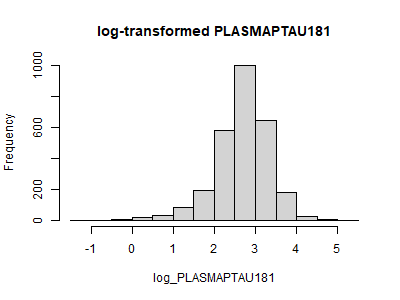{width="400"}

### Distribution of NfL after log-transformation

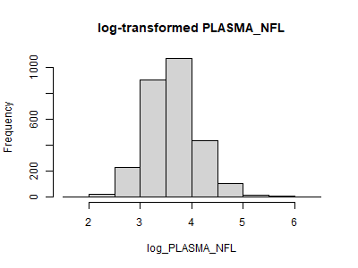{width="400"}

### Correlation plot over the numerical variables used in the Cox PH models

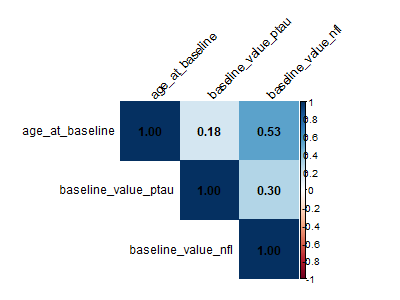

### Correlation plot over the numerical variables used in the LME models

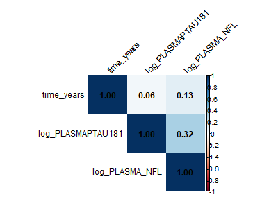

## Test Results

```{r}
#| pos: "H"
#| tbl-pos: "H"
#| tbl-cap: "Results of the likelihood ratio tests to determine the random effects structure for LME models"
kable_standard(readRDS("tables/long_re_lrt_table.rds"))
```

```{r, echo=FALSE}
#| pos: "H"
#| tbl-pos: "H"
#| tbl-cap: "P-values for the proportional hazards assumption tests for all covariates in the Cox PH models"
kable_standard(readRDS("tables/table_ph.rds"))
```

```{r}
#| pos: "H"
#| tbl-pos: "H"
#| tbl-cap: "Results of the likelihood ratio test for the Cox PH models with and without gender as a covariate"
kable_standard(readRDS("tables/surv_lrt_table.rds"))
```

## Residual Diagnositics

### Fitted values versus residuals from the LME model for p-tau181

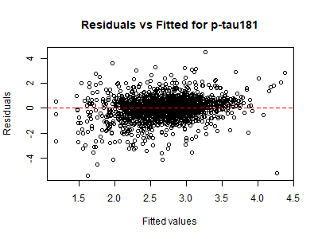{width="400"}

### Q-Q plot of the LME model for p-tau181

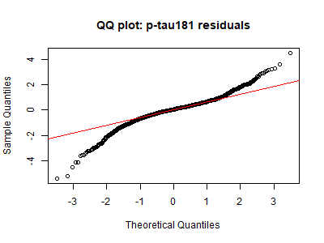{width="400"}

### Fitted values versus residuals from the LME model for NfL

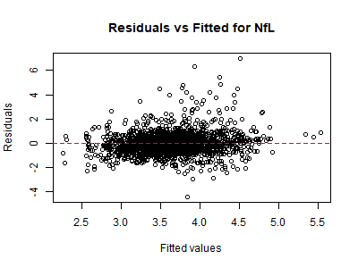{width="400"}

### Q-Q plot of the LME model for NfL

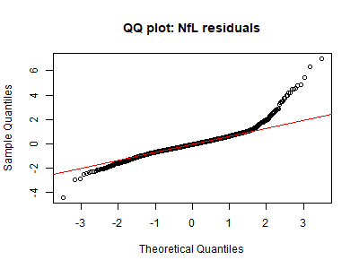{width="400"}

## Convergence

### Trace plot of the $α$-parameter for the joint model of NfL

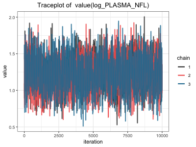

### Trace plots of the $α$-parameters for the multivariate joint model

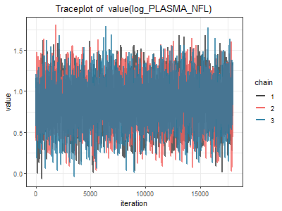

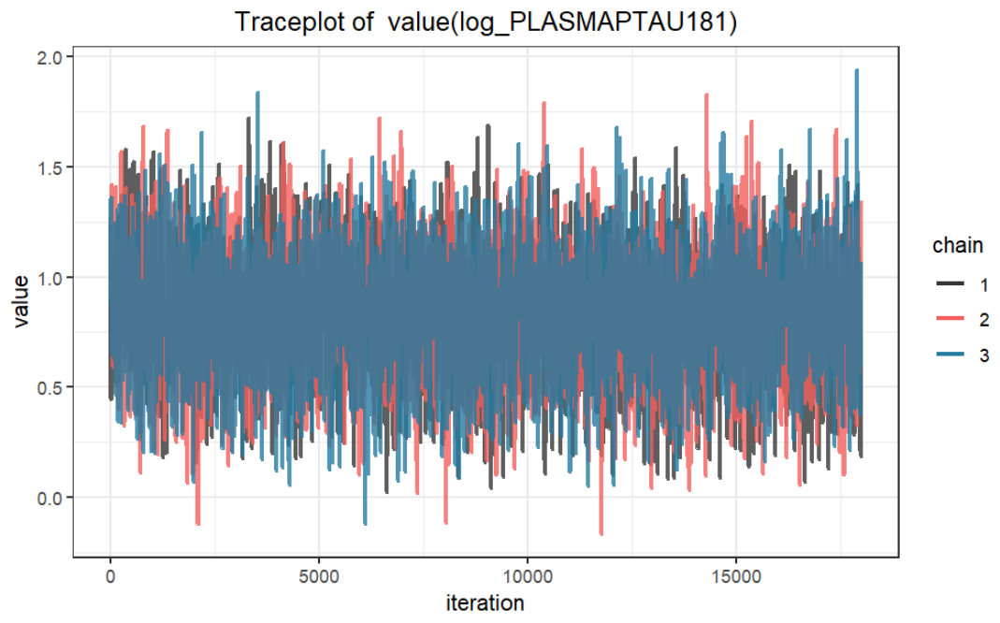{width="400"}

## Model Results

```{r}
#| pos: "H"
#| tbl-pos: "H"
#| tbl-cap: "Model parameters for the two class JLCMM with longitudinal measurements for p-tau181"
kable_standard(readRDS("tables/jlcmm_m1_ptau_output.rds"))
```

```{r}
#| pos: "H"
#| tbl-pos: "H"
#| tbl-cap: "Model parameters for the two class JLCMM with longitudinal measurements for NfL"
kable_standard(readRDS("tables/jlcmm_m1_nfl_output.rds"))
```

## AUC and Brier Curves: Model Comparison

### Time-dependent AUC curves for the NfL models

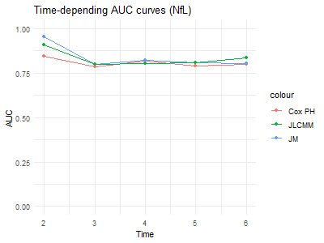{width="400"}

### Time-dependent AUC curves for the multivariate models

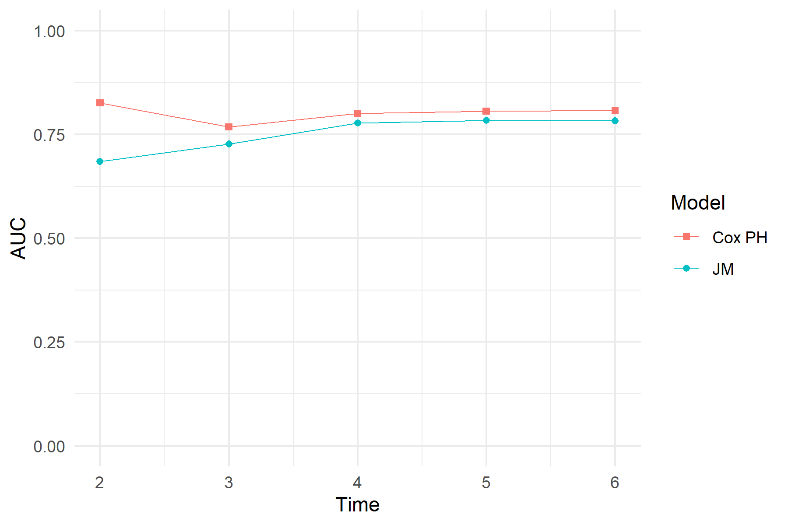{width="400"}

### Time-dependent Brier score curves for the NfL models

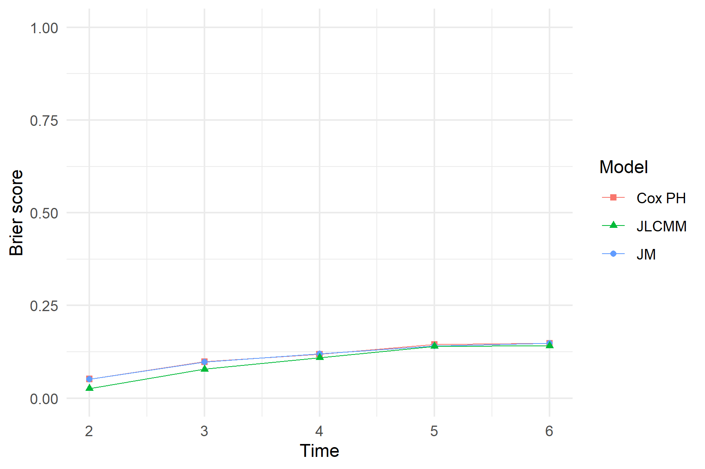{width="400"}

### Time-dependent Brier score curves for the multivariate models

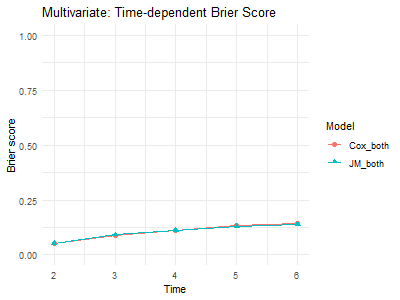{width="400"}

## AUC and Brier Curves: Biomarker Comparison

### Time-dependent AUC curves for the joint models

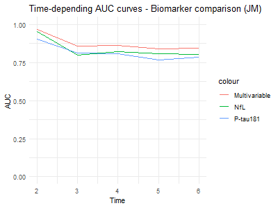{width="400"}

### Time-dependent AUC curves for the latent class joint models

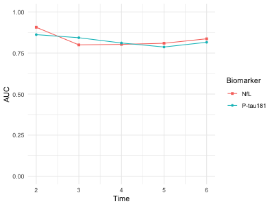{width="400"}

### Time-dependent Brier score curves for the joint models

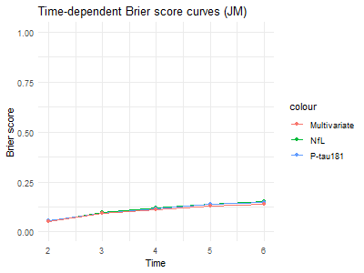{width="400"}

### Appendix X: Time-dependent AUC curves for the latent class joint models

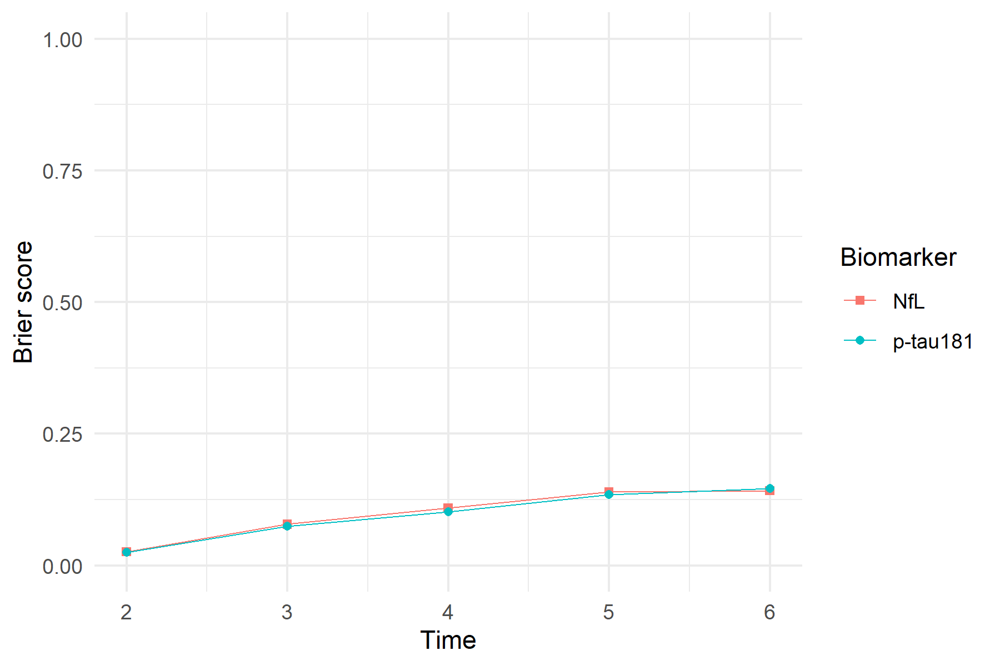{width="400"}

## Precision Analysis: 1+ Biomarker Measurements

```{r}
#| pos: "H"
#| tbl-pos: "H"
#| tbl-cap: "Summary of fit statistics for JLCMM with 1+ longitudinal measurements for p-tau181"
kable_standard(readRDS("tables/summary_jlcmm_ptau_full.rds"))
```

```{r}
#| pos: "H"
#| tbl-pos: "H"
#| tbl-cap: "Summary of posterior probabilities for the two class JLCMM with 1+ longitudinal measurements for p-tau181"
kable_standard(readRDS("tables/pprob_m1_ptau_full.rds"))
```

```{r}
#| pos: "H"
#| tbl-pos: "H"
#| tbl-cap: "Summary of posterior probabilities for the three class JLCMM with 1+ longitudinal measurements for p-tau181"
kable_standard(readRDS("tables/pprob_m2_ptau_full.rds"))
```

```{r}
#| pos: "H"
#| tbl-pos: "H"
#| tbl-cap: "Model parameters for the two class JLCMM with 1+ longitudinal measurements for p-tau181"
kable_standard(readRDS("tables/jlcmm_m1_ptau_full"))
```

```{r}
#| pos: "H"
#| tbl-pos: "H"
#| tbl-cap: "Summary of fit statistics for JLCMM with 1+ longitudinal measurements for NfL"
kable_standard(readRDS("tables/summary_jlcmm_nfl_full.rds"))
```

```{r}
#| pos: "H"
#| tbl-pos: "H"
#| tbl-cap: "Summary of posterior probabilities for the two class JLCMM with 1+ longitudinal measurements for NfL"
kable_standard(readRDS("tables/jlcmm_m1_nfl_full"))
```

```{r}
#| pos: "H"
#| tbl-pos: "H"
#| tbl-cap: "Model parameters for the two class JLCMM with 1+ longitudinal measurements for p-tau181"
kable_standard(readRDS("tables/jlcmm_m1_ptau_full"))
```
