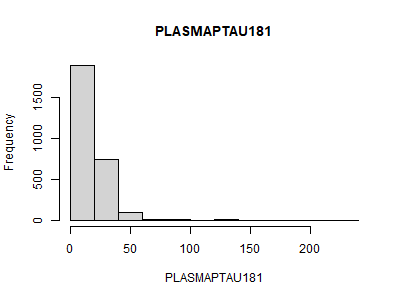

---
format:
  pdf:
    include-before-body:
      text: |
        \begin{titlepage}
        \raggedleft
        \vspace*{2cm}
        
        {\Huge\bfseries Kandidatuppsats\par}
        \vspace{1.5cm}
        
        {\Large Statistiska Instiutionen\par}
        \vspace{3cm}
        
        {\Huge\bfseries Nr 2026:x\par}
        \vspace{0.5cm}
        
        {\LARGE \bfseries Title in English\par}

        {\large Title in Swedish\par}
        \vspace{0.5cm}
        
        {\large \today\par}
        \vspace{3cm}
        
        {\Huge Charlotte Emily Iszatt and Milou Rossi\par}
        
        \vfill
        
        \end{titlepage}
        
        \begin{titlepage}
        \raggedleft
        
        {\normalsize Självständigt arbete 15 högskolepoäng inom Statistik III, VT2026\par}
        {\normalsize Handledare: Hans Nyqvist\par}
        \vspace{2cm}
        
        \raggedright
        {\huge\bfseries Abstract\par}
        \vspace{1cm}
        
        {\Large The abstract text can go here. The abstract text can go here. The abstract text can go here. The abstract text can go here. The abstract text can go here. The abstract text can go here. The abstract text can go here. The abstract text can go here. The abstract text can go here. The abstract text can go here. The abstract text can go here. The abstract text can go here. The abstract text can go here. The abstract text can go here. The abstract text can go here. The abstract text can go here. Keywords: XXX, XXX, XXX\par}
        \vspace{3cm}
        
        \vfill
        
        \end{titlepage}
    toc: false
    colorlinks: false
    number-sections: true
editor: visual
---

```{=latex}
\tableofcontents

\newpage
```

# Introduction

## Background

According to the World Health Organization (2025), Alzheimer's disease (AD) is the most common neurodegenerative disorder and a leading cause of dementia around the world. First described by Dr. Alois Alzheimer in 1901, the disease continues to present significant challenges for the medical field, and no definitive cure exists to date (WHO, 2025). The 2011 National Institute on Aging-Alzheimer’s Association (NIA-AA) diagnostic guidelines describe the disease as a continuum with three stages: a symptom-free stage (preclinical AD), a predementia stage (mild cognitive impairment (MCI) due to AD) and a dementia stage (dementia due to AD) (Carrillo et al. 2013, p. 596). Pathophysiological changes due to AD can begin up to 20 years before clinical symptoms appear, highlighting the crucial importance of early diagnosis and timely intervention to potentially slow the progression of the disease (Carrillo et al., p. 595).

In the context of AD, as well as diseases in general, the term "biomarker" is commonly used. According to the Biomarkers Definitions Working Group, a biomarker is defined as "a characteristic that is objectively measured and evaluated as an indicator of normal biological processes, pathogenic processes, or pharmacologic responses to a therapeutic intervention." (2001, p. 91).

AD pathophysiology has typically been detected by positron emission topography (PET) to confirm the presence and degree of amyloid plaques in the brain or by quantification of biomarkers implicated in AD pathology in cerbrospinal fluid (CSF) (Mattson, N., 2017, p. 557). The former method involves radiation and the latter requires a lumbar puncture in order to extract the CSF. WHO published a report in 2024 highlighting the promising progress made in recent years regarding the use of blood-based biomarkers to support AD diagnosis (WHO, p. 6). Specifically, recent breakthroughs in technology (Rissin et al., 2010) have allowed for quantification of biomarkers at much smaller concentrations than previous methods, typically being up to 1000 times more sensitive (Chang et al., 2012, pg. 2). Using this method, biomarkers can be detected peripherally from their origin where concentrations are much smaller. These advances mean that more invasive procedures can be substituted with blood tests.

According to the NIA-AA, there are several core biomarkers used in the diagnosis and staging of AD (Jack et al., 2024). One such core biomarker is tau protein phosphorylated at the threonine-181 position (p-tau181), where concentrations are expected to be higher in individuals with AD pathology (Wong et al., 2012, p. 815). Another core biomarker of interest in the diagnosis of AD pathology is neurofilament light chain (NfL), which is instead a marker of neuronal injury not specific to AD (Jack et al., p. 5158). NfL is usually present inside neurons, and therefore concentrations are expected to be higher in individuals with neuronal injury symptomatic of AD (Clark, C., 2021, p. 7). Research suggests that it may be used as a prognostic marker of cognitive decline and may also support the diagnosis of other diseases, including frontotemporal dementia, whilst p-tau181 is more useful for differentiating AD from other neurodegenerative conditions (WHO, 2024, p. 7).

These two blood-based biomarkers, along with various other biomarkers and clinical measures related to AD, are the main focus of the *Alzheimer’s Disease Neuroimaging Initiative* (ADNI), whose main goals are to provide open-access data to researchers worldwide and to improve the diagnosis of AD (ADNI, n.d.). Since 2004, researchers across more than 60 clinical sites in the USA and Canada have continuously collected and analyzed data throughout the different phases of the study. Blood samples from the ADNI cohort have been retrospectively analysed using the recently developed method in order to quantify the levels of p-tau181 and NfL in 2020 and 2018 respectively (Zetterberg & Blennow, 2020; Blennow, 2018).

## Research Context

*Assessing the current landscape in terms of the scientific literature. What is known? What has been done Where are there gaps??? (This leads on to the next section, why are we doing this research, how do we hope to answer some remaining question in the AD research, orient this towards the statistical analysis/approaches!)*

Recent research has applied a range of prognostic models to estimate disease progression and related adverse outcomes in AD using biomarker data. One example is an article from 2020, in which the researchers used baseline plasma p-tau181 as a continuous predictor in a Cox proportional hazards model (Janelidze et al., 2020, 388) the most widely used procedure for modeling survival outcomes in relation to covariates (Therneau & Grambsch, 2000, p. 39). Additionally, they covaried for other plasma biomarkers, among which NfL. While adjusting the models for age, sex and education, the study found that higher baseline plasma p-tau181 levels were strongly associated with increased risk of progression to Alzheimer’s dementia, with hazard ratios around 3-4 per standard deviation increase. In the model including only p-tau181, it was a strong predictor of conversion across groups, with hazard ratios ranging from approximately 2.5 to 3.8 depending on cognitive status. When additional plasma biomarkers were included in the multivariate model, p-tau181 remained significant with only a slight reduction in effect size, whereas NfL showed no independent association with disease progression, with hazard ratios close to 1, indicating no meaningful contribution to risk prediction (Janelidze et al., pp. 385, 388).

Another article from 2024 further extended the approach by using a joint modeling framework to analyze multiple longitudinal biomarkers, including plasma p-tau181 and NfL (Yuan et al., p. 1). The joint model distinguishes itself from other models focusing on survival outcome by accounting for the effect of an endogenous time-dependent covariate measured with error, such as a biomarker (Rizopoulos, 2012, p. vii). More precisely, it couples the survival model, which is of primary interest, with an appropriate model for the repeated measurements of the endogenous covariate, thereby accounting for its specific characteristics (Rizopoulos, 2012, p. 51-52). Several studies have examined these biomarkers using only a longitudinal model (Mattsson et al., 2019; Chen et al., 2021). The study using a joint model found that higher longitudinal p-tau181 levels were associated with a significantly increased risk of progression, with the joint model estimating a hazard ratio of approximately 5.83 for p-tau181 and 4.18 for NfL (Yuan et al., p. 1). Additionally, the two biomarkers were combined into a multivariate joint model, leading to improved performance (Yuan et al., pp. 1, 3).

Additionally, for understanding the natural history of a disease, researchers in an article from 2023 describe it as crucial to simultaneously account for the assessment of multivariate markers over time, the occurrence of clinical endpoints, and a highly suspected heterogeneity between patients (Proust-Lima et al., p. 3996). Subsequently, they proposed a latent class approach modeling multiple repeated markers to help describe complex disease progression and identify subphenotypes for exploring new pathological hypotheses; in other terms, a joint latent class model. Through the example of progression to multiple system atrophy (MSA), characterized by various combinations of progressive autonomic failure and motor dysfunction, the researchers identified five subphenotypes of MSA that differ by the sequence and shape of marker degradation, as well as the associated risk of death (Proust-Lima et al., p. ?).

Similarly, in an article from 2026, researchers applied a multi-dimensional joint latent class model to capture heterogeneity in the trajectories of three cognitive domains from the time of Alzheimer’s dementia diagnosis: memory, language, and executive functioning (Scollard et al., p. 383). They identified five latent classes differentiated by overall level of impairment, ranging from high to low, and rate of decline, from slow to fast. Within each latent class, the pattern of decline was relatively consistent across cognitive domains, suggesting parallel deterioration across functions rather than domain-specific divergence. In addition, class membership was associated with several key variables, such as APOE genotype, sex, race, education and neuropathological burden (Scollard et al., p. 383). Despite these advances, such modeling approaches have rarely been applied to longitudinal plasma biomarkers in AD research. Since there is evidence to support AD as a heterogeneous disease with differing disease trajectories (**SOURCE**), a latent class joint model could be employed to assess whether individuals can be categorised into meaningful classes based on NfL and p-tau181 trajectories alongside survival data.

Thus, the question arises as to which modeling approach is best suited for predicting progression to AD dementia when considering the added value of longitudinal biomarker information. Few studies have systematically compared the previously mentioned modeling approaches within a unified framework in AD, specifically focusing on plasma biomarkers such as NfL and p-tau.

Additionally, an important consideration is whether to include all participants with repeated biomarker measurements. Although the two previously mentioned studies included all participants regardless of the number of measurements per individual, this is not always the case. For example, a study examining different cognitive biomarkers to predict progression to AD explicitly states: "Participants were included if they had a baseline diagnosis of MCI and at least three follow-up visits with complete longitudinal cognitive assessments" (Guo et al., 2026, p. ? ). Similarly, in a study on type 1 diabetes and primary biliary cirrhosis (PBC), the joint model analysis was restricted to participants with recorded height and weight and at least three biomarker measurements (Xu, 2021, p. 9). Another study, focusing on cardiovascular events, restricted their joint model analysis to the cohort of 3784 patients who had at least 10 measurements of the selected biomarker (Wang et al., 2024, p. 591-592).

In other words, some studies include all available participants, while others impose minimum requirements on the number of repeated measurements, thereby excluding individuals with only a single observation. This variation in inclusion criteria reflects an ongoing methodological discussion regarding how longitudinal data should be handled in practice. For example, in the previously mentioned study, such restrictions were applied to ensure that the approximation method did not lead to “non-ignorable biases” (Wang et al., p. 591). On one hand, participants with only a single observation do not provide information about change over time within individuals. On the other hand, their observations at a single time point still contribute useful information to the analysis by informing estimates of variability and between-subject effects (Fitzmaurice et al., 2011, chapter 8, pp. 214-215).

The choice of inclusion strategy also has important implications for statistical efficiency and validity. Analyses restricted to individuals with complete data are generally less efficient than methods that use all available information, resulting in a loss of precision. This loss depends on the pattern and distribution of missing data across subjects and time points, as well as the extent to which missingness is related to observed outcomes. Importantly, missing data may under certain circumstances also introduce bias, potentially leading to misleading inferences about changes in the mean response. Consequently, the mechanism underlying missing data is a critical consideration in longitudinal analyses, as it determines whether exclusion of incomplete cases may distort results (Fitzmaurice et al., chapter 17, p. 491).

Additionally, linear mixed-effects models are specifically designed to accommodate unbalanced longitudinal data and do not require the same number of observations for each subject, nor measurements at identical time points. This flexibility, together with their ability to model covariance structures in a parsimonious way, makes them particularly well suited for analysing inherently unbalanced data (Fitzmaurice et al., chapter 8, p. 190).

## Research Aims

This study investigates the prediction of AD/dementia progression using longitudinal biomarker data, comparing traditional and advanced statistical approaches. More precisely, the research questions are:

1.  Which modeling approach provides the best prediction of progression to dementia due to AD when using longitudinal blood biomarker data? (Including baseline levels, single-biomarker joint models, multivariate joint models, univariate latent class joint models and multivariate latent class joint models)
2.  How do these associations differ between p-tau181 and NfL? (Comparison across biomarkers)
3.  How does the precision of the estimated longitudinal trajectories and their associations with progression (survival outcomes) change when including individuals with different numbers of repeated measurements? (Precision analysis)

# Methodology

*How will we accomplish this? –\> Introduce the methods we will use.*

To address the research questions, a series of models will be implemented and compared. First, Cox proportional hazards (Cox PH) models will be fitted using baseline biomarker levels as covariates to assess their association with progression to dementia due to AD. Second, univariate joint models will be applied to simultaneously model the longitudinal trajectories of each biomarker separately and their association with the survival outcome. Third, multivariate joint models will be used to jointly model both biomarker trajectories simultaneously, allowing for the estimation of their combined and potentially correlated effects on disease progression. Finally, a latent class joint modelling approach will be implemented to account for unobserved heterogeneity in longitudinal biomarker trajectories and risk of progression by identifying possible latent subgroups. A univariate joint latent class model will be fit for NfL and p-tau181 trajectories seperately, which is then compared with a multivariate joint latent class model which models both NfL and p-tau181 simultaneously. All models will be adjusted for relevant covariates.

To investigate differences between p-tau181 and NfL, the modelling frameworks will be applied separately for each biomarker, followed by a comparative evaluation of their predictive performance and estimated associations with clinical progression. The significance level will be set at 0.05 for all analyses.

More specifically, model performance will be evaluated using time-dependent AUC and Brier score for dynamic prediction. For prognostic models predicting progression from MCI to AD dementia, the prediction horizon varies across studies, but a 2-4 year follow-up is most commonly used (Xia et al., 2025, p. 213). This reflects the typical disease course, where a substantial proportion of individuals with MCI convert to dementia within a few years of follow-up; around one-third of individuals with MCI due to AD progress to dementia within five years (Alzheimer’s Association, n.d.). Based on this, time horizons of 1, 2, 3, 4, and 5 years were selected to capture short- to mid-term progression.

In addition, a precision analysis will be conducted to assess how the number of repeated measurements per individual influences the estimation of longitudinal trajectories and their associations with the survival outcome. This will be evaluated by comparing results between individuals with at least one repeated biomarker measurement and those with at least three repeated measurements, and by assessing differences in model stability and parameter precision.

There exists a wide range of biomarkers for AD that could be investigated in this context. However, given that plasma-based biomarkers have only relatively recently gained attention in research, their inclusion was considered both timely and relevant. Accordingly, the two biomarkers included in the analyses are p-tau181 and NfL. They were selected due to their established relevance in the prediction of dementia and AD progression, as well as the availability of rich longitudinal data with repeated measurements and overlapping follow-up information. Even though other clinically relevant biomarkers are available, they were not included due to the limited availability of sufficiently large longitudinal datasets with repeated measurements. In this study, priority was given to data quality and longitudinal depth rather than the number of biomarkers considered. In addition, the selected biomarkers represent biologically distinct processes: p-tau181 is more specifically associated with AD pathology, while NfL reflects more general neuroaxonal damage and is not disease-specific. This contrast makes them particularly informative for comparative analyses of biomarker behaviour and predictive performance in dementia progression.

Additional modelling approaches could have been considered given the aims of the study. For instance, the Cox Proportional Hazards model can be extended for modelling the relationship between time-dependent covariates and survival time. Caution implementing these must be taken, however, as the model cannot handle endogenous time-dependent covariates such as biomarkers, only those which are exogenous (Rizopoulos, 2012, p.51). **For example, if the event is defined as death, endogenous variables can inherently effect the survival outcome only be Endogenous variables inherently carry information about survival times........**

**Consequently, this approach is not included in the present study.**

In addition, given the limited time and scope of this thesis, including a larger number of modelling frameworks would have reduced the ability to investigate each approach in sufficient depth. Therefore, a smaller set of models was selected in order to allow for a more detailed and meaningful comparison. The chosen models were selected based on their methodological relevance and their ability to capture different aspects of the data, thereby providing a broad overview of alternative approaches for modelling longitudinal biomarker data and survival outcomes.

The modelling approaches will be applied to data obtained from the ADNI and handled in accordance with their data use and access policies. In this context, it is also worth noting the limited availability of AD data in Sweden due to legal and regulatory constraints governing access to health data. This limitation further increases the importance of utilizing well-characterized international datasets such as ADNI, as they provide the necessary longitudinal and high-quality data required to conduct the types of analyses performed in this study.

# Statistical Theory

*Describe the statistical theories behind the chosen methods*

*Måste förkortas och göras mer sammanhängande*

## Survival Analysis

As all modeling approaches considered in this study aim to model time to progression to AD, they are grounded in the survival analysis framework. Survival analysis, also known as time-to-event analysis, focuses on both whether an event occurs and the time from the start of follow-up until its occurrence (Ranganathan, Deo & Pramesh, 2025, p. ?). The start of follow-up, also referred to as baseline, is defined as an initial measurement taken at an early time point that serves as a reference for assessing changes over time (NCI, n.d.). The event of interest may include death, disease onset, relapse or recovery. However, this type of data analysis faces two main challenges. First, survival times are often skewed rather than normally distributed. Second, for some individuals the exact event time is unknown because the event has not occurred by the end of follow-up or because participants are lost to follow-up. This is referred to as censoring. Therefore, specialized statistical methods are required in order to appropriately incorporate both complete and censored observations when estimating survival-related quantities (Ranganathan, Deo & Pramesh, p. ?)

With respect to the temporal relationship between the event and censoring time, censoring is typically classified as either right or left censoring (Rizopoulos, 2012, p. 36). Right censoring occurs when, for some individuals, the event of interest is not observed during the study period, although it is known to occur after the last recorded observation. This may arise if follow-up ends before the event occurs, if the study is terminated after a pre-specified number of events, or if participants are lost to follow-up due to relocation or similar reasons. In all such cases, the exact event time is unknown but is known to exceed the last observed time point (Rizopoulos, p. 36). In studies of AD, not all participants develop the disease during the follow-up period; for these individuals, the exact time of onset is unknown, and they are therefore considered right-censored observations.

Left truncation - However, when longitudinal data are collected at different time points, issues such as left truncation (also referred to as delayed entry) can arise. It occurs when individuals enter the study after the origin of the underlying time scale, meaning that only individuals who have survived or remained event-free up to the point of entry are included in the analysis (källa?).

## Cox Proportional Hazards Model

To quantify the association between biomarkers and disease progression, relative hazards models are commonly used. These models compare the hazard of progression between individuals with different covariate profiles, and assume that their hazard rates are proportional. Taking root in the Lehmann alternative for comparing survival functions, which assumes that two survival functions, $S_0(t)$ and $S(t)$, are related such that:

$$S(t) = [S_0(t)]^{\psi}$$

where $\psi$ is the proportional hazards constant (Moore, 2016, pp. 43 - 44). This relationship can be re-expressed in terms of their hazard functions to give:

$$h(t) = \psi h_0(t)$$

which is the proportional hazards assumption (Moore, p. 55). Further, covariate information is linked to the proportional hazards constant exponentially, yeilding the following model:

$$h(t) = h_0(t) exp\left\{ \mathbf{x}^T \boldsymbol{\beta} \right\}$$

where $\mathbf{x}^T$ is a vector of covariates and $\boldsymbol{\beta}$ is a vector of model parameters. In this analysis, the covariates of interest in the hazard model are age, gender, APOE-$\epsilon 4$ status and baseline p-tau181 and NfL values.

### Model Assumptions

- What do we assume about the censoring process?

A key assumption of this model is the assumed proportionality between hazard functions for different values of the specified covariates. This assumption is crucial for the construction of the partial likelihood, which allows the survival distribution to remain unspecified, as it allows the baseline hazard function to be dropped from the partial likelihood. At the same time, minor violations of this assumption are generally unlikely to have substantial effects on inference and parameter estimation (Moore, p. 94).

### Concordance Index

The concordance index (C index) is an evaluation measure for the performance of survival models. All pairs of individuals are selected, and the C index evaluates the proportion of pairs who are concordant, where the individual with a higher cumulative incidence, calculated as $1 - S(t)$, has the shorter time-to-event (Seo Young Park et al., 2017, p. 1701).

## Joint Modelling of Longitudinal and Survival Data

In the joint model of longitudinal and survival data, the hazard function at time $t$ is directly dependent on the value of the biomarker level at time $t$. In AD research specifically, biomarkers such as p-tau181 and NfL are measured repeatedly over time, and their relationship between their trajectories and disease progression is analysed.

The longitudinal process - modelled by a linear mixed-effects model - and the survival process - modelled by a proportional hazards model - are linked by a specified association structure. This structure can link the survival process to the current value of the biomarker estimate only, or include the current rate of change of the biomarker trajectory. For instance, if both the current value and current rate of change are specified in the proportional hazards model, this becomes:

$$h(t|M_i, \mathbf{v_i}) = h_0(t)exp\left\{\boldsymbol{\gamma}^T\mathbf{w}_i + \alpha_1 m_i(t) + \alpha_2 m_i'(t) \right\} \qquad m_i'(t) = \frac{d}{dt} m_i(t)$$

where $\alpha_1$ and $\alpha_2$ link the current value of the biomarker, $m_i(t)$, and the current rate of change, $m_i'(t)$, respectively to the hazard function. Further, $\boldsymbol{\gamma}^T$ is a vector of log-hazard ratios and $\mathbf{w}_i$ is a vector of time-independent covariates for the $i^{th}$ individual.

This univariate framework is applied to the longitudinal p-tau181 and NfL measurements separately to model their trajectories jointly with survival outcomes. Multivariate joint models extend the standard joint modeling framework by allowing two or more longitudinal biomarkers to be modeled jointly while being linked to a shared survival outcome describing progression to AD or dementia. Therefore, both p-tau181 and NfL are then considered simultaneously, as they capture complementary aspects of neurodegeneration and Alzheimer-related pathology. **Ignoring their correlation may lead to biased estimation. The bayesian approach allows for multivariate joint modelling (Andrinopoulou & Rizopoulos, 2016, p.?).**

### Linear Mixed-Effects Submodel

The longitudinal component of the joint model is specified by the linear mixed-effects model (**LAIRD & WAIRE**), which captures both population-level trends and individual variability in biomarker trajectories.

Longitudinal data consists of repeated measurements from the same individuals, wherby the assumption of independence between observations is illogical. In this analysis, the levels of p-tau181 and NfL for an individual at a specific time point, $t$, are correlated with the measurements made on prior and subsequent occasions. Therefore, the responses from an individual are expected to be more highly correlated than those between individuals. The modelling of this type of data, where the data can be considered grouped and where there is non-independence between observations, is handled well by linear mixed-effects models.

Following the notation of Rizopoulos (p. 54), the biomarker process for p-tau181 and NfL can be considered such that:

$$ y_i(t) = m_i(t) + \epsilon_i(t) \qquad \epsilon_i(t) \sim N(0, \sigma^2) $$

$$ m_i(t) = \mathbf{X_i^T}\boldsymbol{\beta} + \mathbf{Z_i}^T\mathbf{b_i} \qquad \mathbf{b_i}(t) \sim N(0, \sigma^2) $$

where $y_i(t)$ is the observed biomarker measurement at time $t$ for individual $i$. Assuming that the true biomarker value is not observed due to measurement and other errors, $m_i(t)$ then is the trajectory function which represents the true unobserved value of the biomarker at time $t$ for patient $i$. The fixed effects are described by $\mathbf{X_i}^T(t)\boldsymbol{\beta}$ and the random effects by $\mathbf{Z_i}^T\mathbf{b_i}$, where $\boldsymbol{\beta}$ are population-specific parameters and $\mathbf{b}_i$ are subject-specific parameters (Verbeke & Geert Molenberghs, 2000, p. 23). These subject-specific parameters handle the non-independence of the repeated measurements. Combining the true biomarker trajectory function with the error term gives:

$$ y_i(t) = \mathbf{X_i^T}\boldsymbol{\beta} + \mathbf{Z_i}^T\mathbf{b_i} + \epsilon_i(t) \qquad \mathbf{b_i}(t) \sim N(0, \sigma^2), \quad \epsilon_i(t) \sim N(0, \sigma^2) $$

The linear mixed-effects model can be generalised when the response variable does not follow an approximately normal distribution. In this case, some link function, $g(x)$, links the expected value given the random effects to the linear predictor, which takes into acount both the fixed and random effects (Rizopoulus, pp. 139 - 140). This approach is tested, as p-tau181 and NfL measurements are not normally distributed.

(**LAPLACE vs. MCMC in different packages - estimation)**

### Survival Submodel

Assuming the survival submodel is defined as a Cox PH model, the longitudinal biomarker process is incorporated with the survival process, given a current value only association structure, such that:

$$h(t|M_i, \mathbf{v_i}) = h_0(t)exp\left\{\gamma^T\mathbf{w_i} + \alpha m_i(t) \right\} \qquad M_i = \left\{m_i,  0 \le s \le t\right\}$$

where $M_i$ represents the true unobserved biomarker profile up to time t.

- Time-to-diagnosis process

- Parametric baseline hazard: **flexible parametrics, splines??**

- OR leave undefined -\> Cox PH model

**MORE... Weibull in estimation.**

### Model Assumptions

A core assumption of the joint model for longitudinal and survival data is full conditional independence between the longitudinal outcome and the survival outcome. All dependence is assumed to be explained by the random effects, resulting in independence of the longitudinal and survival outcomes and the repeated biomarker measurements are independent of each other. (**REF**)

### Estimation

**\*\*Frequentist vs Bayesian Approach\*\***

The primary estimation approach that has been proposed for joint models is (semiparametric) maximum likelihood (Rizopoulos, 2012, p. 62). However, a key difficulty in joint modelling is that the estimation process can be very computationally demanding and may sometimes be impractical. This becomes even more challenging when the data include measurement error, missing values, or nonlinear longitudinal patterns, since these features increase model complexity.

An alternative is a Bayesian estimation approach, which differs from the frequentist framework in that, while the frequentist approach treats parameters as fixed but unknown quantities estimated solely from the data, the Bayesian approach treats parameters as random variables and combines a prior distribution with the observed data to obtain a posterior distribution (Carlin & Louis, 2008). From this perspective, joint modelling can be done in a more direct way, often avoiding many of the complex approximations that are typically required in frequentist methods. At the same time, when weakly ninformative priors are used, the resulting estimates are often very similar to those obtained from maximum likelihood approaches (Wu et al., 2008; Brown et al., 2003, p. 222).

**\*\*Kanske kort beskrivning om generella skillnaden mellan bayesian vs frequentist? -\> fokusera på bayesiansk istället, kanske inte viktigt med frekventist här \*\***

With the R package JMbayes, joint models can be fitted under a Bayesian approach using Markov chain Monte Carlo (MCMC) algorithms (Rizopoulos, 2018). MCMC is a stochastic procedure that repeatedly generates random samples to characterize the distribution of parameters of interest, which in a Bayesian setting corresponds to the posterior distribution. These samples are generated by a Markov chain, which can be viewed as a directed random walk through the parameter space where each step depends only on the current state, and where parameter values are sampled in proportion to their probability. In this way, the chain gradually reconstructs the target distribution even when it is not available in closed form. Convergence refers to the point at which the Markov chain has reached its stationary distribution, meaning that the generated samples can be treated as representative of the posterior distribution and used for inference through Monte Carlo integration.(Hamra, MacLehose, & Richardson, 2013, p. 628).

Regarding the prior distribution in the Bayesian framework, JMbayes uses weakly informative priors that support stable estimation while allowing the data to primarily drive inference.More specifically, regression coefficients are typically assigned independent normal priors with mean zero and large variance, while variance components follow inverse Gamma priors. The dependence structure of the random effects is defined through a correlation matrix and standard deviations, where the correlation matrix follows an LKJ prior and the standard deviations follow half Student t priors (Rizopoulos, 2018).

The association parameters linking the longitudinal and survival processes are also given normal priors with mean zero and large variance. The baseline hazard function is modelled flexibly using B splines, where smoothness is controlled through penalised Gaussian priors together with Gamma distributed smoothing parameters (Rizopoulos, 2018).

This prior structure mainly acts as regularisation while allowing the data to drive inference. In multivariate settings, additional association parameters can be introduced, and shrinkage priors like global-local or ridge-type priors can be used to handle higher dimensional parameter structures (Rizopoulos, 2018).

### The Gelman-Rubin Statistic

Convergence within the framework of Bayesian joint modeling can be evaluated by running multiple chains from different starting values (Peng, 2022, chapter 7.4.2). All chains are expected to eventually reach the stationary distribution and become indistinguishable. Convergence can be assessed by comparing variation between chains to variation within chains, with small between-chain variation indicating that the chains are similar (Peng, chapter 7.4.2).

The Gelman-Rubin statistic R formalizes this idea (Peng, chapter 7.4.2). Consider $J$ Markov chains, each with samples $x_1^{(j)}, x_2^{(j)}, \dots$ from the $j$-th chain. For each chain, remove the first $D$ samples as “burn-in” and retain the following $L$ samples: $x_D^{(j)}, x_{D+1}^{(j)}, \dots, x_{D+L-1}^{(j)}$. One common choice is to set $D = L$.

Then calculate the chain mean for each chain,

$$\bar{x}_j = \frac{1}{L} \sum_{t=1}^{L} x_t^{(j)}$$

the overall mean across all chains (the grand mean),

$$\bar{x}_\cdot = \frac{1}{J} \sum_{j=1}^{J} \bar{x}_j$$

the between-chain variance,

$$B = \frac{L}{J-1} \sum_{j=1}^{J} \left(\bar{x}_j - \bar{x}_\cdot\right)^2$$

the within-chain variance for each chain,

$$s_j^2 = \frac{1}{L-1} \sum_{t=1}^{L} \left(x_t^{(j)} - \bar{x}_j\right)^2$$

and finally, the average within-chain variance,

$$W = \frac{1}{J} \sum_{j=1}^{J} s_j^2$$

Subsequently, the Gelman-Rubin statistic is:

$$R = \frac{\frac{L-1}{L} W + \frac{1}{L} B}{W}$$

As the number of iterations L increases and the between-chain variation B decreases, R approaches 1. Thus, chains are typically run until R is near 1, often around 1.1 or 1.2. Being a unit-free ratio, R provides a convenient summary of convergence without requiring specification of a particular parameter, making it a practical tool for monitoring MCMC chains before any inference is made (Peng, chapter 7.4.2).

## Joint Latent Class Mixed Model

While standard joint models assume a homogeneous population, AD is highly heterogeneous, with patients exhibiting different patterns of cognitive decline and biomarker evolution. Joint latent class models address this by assuming that the population consists of a finite number of unobserved subgroups (latent classes), each characterized by distinct longitudinal trajectories and survival risks.

This model links a longitudinal biomarker process and a survival process whilst assuming that the population, N, is heterogenous and made up of G homogenous and unobserved latent classes (Kyheng, 2025, p.2). Individuals within latent classes are assumed to share longitudinal biomarker trajectories and survival risks (Proust-Lima et al., 2018, p. 5) and the classes are not described by the observed covariates (Rizopoulos, 2012, p. 122). The multivariate joint latent class model extends the joint latent class modeling framework by allowing multiple longitudinal biomarkers to be modeled simultaneously within each latent class, while linking their joint evolution to a class-specific risk. In this analysis, the univariate joint latent class model will be fit on the longitudinal p-tau181 and NfL measurements separately, and then by compared to the multivariate model for both biomarkers, in order to assess which method more accurately models the class-specific hazard of progression to dementia due to AD, and whether, in fact, any latent classes can be distinguished at all.

### Class Submodel

The **JLCM (shorthand or not? question for Milou)** consists of three submodels; a multinomial logistic submodel, a linear mixed-effects submodel and a proportional hazards submodel. Multinomial logistic regression models classes, such that:

$$\pi_{i,g} = Pr(c_i = g | \mathbf{X}_i) = \frac{e^{\mathbf{X}_i \boldsymbol{\beta}_g}}{\sum^{G}_{l = 1}e^{\mathbf{X}_i \boldsymbol{\beta}_l}}$$

where $\mathbf{X}_i$ is the set of covaritates for the $i^{th}$ individual and $\boldsymbol{\beta}_g$ is the set of coefficients for the $g^{th}$ group. If there are no prior assumptions about the latent classes, then there will be no covariates in the multinomial logistic regression model (Kyheng, p.2), which further highlights the assumption that the classes are not described by observed covariates, as per Proust-Lima et al. The class submodel then simplifies to:

$$\pi_{i,g} = Pr(c_i = g) = \frac{e^{\boldsymbol{\beta}_{0,g}}}{\sum^{G}_{l = 1}e^{\boldsymbol{\beta}_{0,l}}}$$

where $\pi_{i,g}$ is the probability that the $i^{th}$ individual belongs to latent class $g$. Linking the class submodel to the linear mixed-effects submodel and the survival submodel, assuming only a random intercept, results in the following:

$$h(t | c_i = g) = h_{0, g}(t)exp\left\{\boldsymbol{\gamma}^T\mathbf{w}_i + \alpha_1 m_i(t) \right\} $$

### Model Assumptions

In JLCMM, the marker and the time-to-event are considered to be conditionally independent given the latent classes and the random effects in the longitudinal model account for the correlation between repeated measures (Proust-Lima et al., 2018, pg. 122), whereas in regular joint models the marker and time-to-event are assumed to be conditionally independent given the random effects (Proust-Lima et al., pg. 62-63). The conditional independence assumptions for the JLCMM are then as follows;

1.  Correlations between observations of the longitudinal biomarker are modelled by the random effects, $b_i$, in the longitudinal model.

2.  The relationship between biomarker trajectory and the time-to-diagnosis is captured completely by the latent class indicator, $c_i$.

There are various methods for assessing the conditional independence assumption, but simulations have demonstrated the superior performance of the score-test statistic in evaluating residual independence between the longitudinal and survival processes, even against two misspecified alternative hypotheses (Jacqmin-Gadda, 2010, p. 17).

The score test assumes the null hypothesis of conditional independence, that is, all correlation between the biomarker trajectory and time-to-event is captured entirely by group membership. Given the class membership is known, there is assumed to be no remaining dependence between the biomarker response and the time-to-event response. Assuming a model with a current value association structure, the association parameter, $\alpha_1$, is assumed to be zero under the null hypothesis (Jacqmin-Gadda, p. 13), such that:

$$H_0: \alpha_1 = 0 \qquad H_A: \alpha_1 \ne 0$$

Under the null hypothesis, the score test statistic, $U$, is $\chi^2$ distributed with degrees of freedom equal to the number of shared-random effects in the model (Proust-Lima et al., p. 8). Therefore, a significant test statistic supports the alternative hypothesis that there is residual dependence between the biomarker and time-to-event responses.

### Estimation

The log-likelihood for the JLCMM is much more tractable than for the regular joint model (Rizopoulos, p. 123), making estimation less computationally demanding. Log-likelihood estimation for JLCMM involves summing over the latent classes (Proust-Lima et al., 2014, p. 5), which is computationally advantageous when compared with the estimation of joint models which require mathematical approximation through, for example, the previously defined MCMC algorithm, due to integration over the random effects. For JLCMM, the log-likelihood is maximised using a **Marquardt algorithm**. In model estimation it should be considered that there may be several local maxima, meaning the algorithm should be run several times using different starting values (Proust-Lima et al., p. 5).

**... MARQUADT ALGO ... ???**

In the $lcmm$ package developed by Proust-Lima et al. for estimating JLCMMs, a Weibull baseline hazard model is estimated by default and it is not possible to estimate a Cox PH model, in order to stay in the full-likelihood framework (Proust-Lima et al., pg. 5). Therefore, it is necessary to assess whether the hazard is best modeled by the Weibull or by a flexible baseline hazard model.

**MORE... Weibull in estimation.**

### **Class Enumeration**

Choosing the number of latent classes, also called class enumeration, is one of the challenges of model selection for joint latent class mixture models. Likelihood ratio tests cannot be performed for nested latent class models with differing number of classes, as regularity conditions which ensure a $\chi^2$ distributed test statistic do not hold (Celeux & Soromenho, 1996, p. 196). Therefore, other metrics must be utilised for this purpose.

According to Proust-Lima et al. (p. 7), one aspect of determining the optimal number of classes is minimisation of the Bayesian Information Criterion (BIC) (**Schwarz, 1978**), which is the preferred criterion for mixture models. RESULTS FROM SIMULATION STUDY (MORGAN ET AL.) Ensuring good discrimination between classes is another important component of selecting the number of classes in the final model. Class discrimination can be assessed by analysis of the posterior class membership probability, given by (Proust-Lima et al., pg. 7):

$$\widehat\pi_{i,g} = P(c_i = g |Y_i, (T^*_i, E_i); \widehat\theta_G) \\
= \frac{
\widehat\pi_{i,g}f(Y_i | c_i=g; \widehat\theta_G)\lambda_i(T_i | c_i=g; \widehat\theta_G)S_i(T_i | c_i=g; \widehat\theta_G)
}
{
\sum_{l = 1}^{G} \widehat\pi_{i,l}f(Y_i | c_i=l; \widehat\theta_G)\lambda_i(T_i | c_i=l; \widehat\theta_G)S_i(T_i | c_i=l; \widehat\theta_G)}$$

Reporting the proportion of individuals who have a posterior probability over a certain threshold (Proust-Lima et al., p. 7), typically 0.7, 0.8 or 0.9 is a way to assess the ability of the model to adequately discriminate classes from one another. Mean posterior probabilities for each class can also be reported, with $\mu(\widehat\pi_g)$ values close to 0.5 showing poor class discrimination.

**Class sizes are also important, as classes that are made up of less than** $5\%$ **of the total sample population may**

**Entropy**

One possible measure of the discriminative power of a latent class structure is relative entropy (Ramaswamy et al., 1993 in Morgan et al., 2016, p. 150), which takes values between 0 and 1 and is calculated as follows:

$$EN(G) = 1 - 
\frac{
\sum_{i = 1}^{N}\sum_{g = 1}^{G} \widehat\pi_{i,g}log(\widehat\pi_{i,g})
}
{
Nlog(G)
}$$

where $G$ is the number of latent classes specified by the model and $\widehat\pi_{i,g}$ is the posterior probability that the $i^{th}$ individual belongs to class $g$. Relative entropy values closer to 1 demonstrate good discriminative ability of the model, where, for one class latent models, $EN(1) = 1$. **\*CONEPTUALLY, WHAT DOES THIS MEASURE???\***

**Integrated Classification Likelihood Criterion**

Both fit and discrimination

**Validation**

The chosen classes should be clinically meaningful.

# Model Comparison

Information criteria such as the Akaike Information Criterion (AIC: **Akaike, 1987**) and BIC are often used to evaluate the overall predictive performance of joint models that combine both longitudinal and survival components. In many applications, however, the main interest is the survival outcome itself, and in particular how well a longitudinal biomarker can be used to predict it (Rizopoulos, p. 194).

This question has been widely studied and has led to two main approaches. One focuses on calibration, meaning how closely the model’s predicted probabilities agree with the observed outcomes. The other focuses on discrimination, meaning how well the model can distinguish between individuals who will experience the event soon and those who will experience it later (Rizopoulos, p. 194).

Time-dependent AUC is an example of a discrimination measure, while the Brier score is an example of a calibration-oriented measure that also reflects overall prediction error over time.

## Time-dependent AUC

ROC analysis is a valuable method for assessing how well diagnostic tests perform, and more generally for measuring the accuracy of statistical models, such as logistic regression and discriminant analysis, that assign individuals to one of two groups, typically classified as diseased or not diseased. Earlier research on ROC methods mainly focused on ordinal rating data, where responses take a limited set of ordered categories reflecting levels of confidence about disease status. More recently, ROC techniques have increasingly been used with continuous data as well (Zou et al., 2012, p. 3)

The traditional ROC curve method assumes that both the disease status and the marker value for each individual remain constant over time. In real-world settings, however, this assumption is often violated. Individuals who are disease-free at baseline may develop the disease during follow-up, and their diagnostic marker values may also change over time. To address this limitation, time-dependent ROC curves have been developed to incorporate the temporal nature of event occurrence and the presence of censored survival data, making them more appropriate for evaluating prognostic accuracy in survival settings (Kamarudin et al., 2017, p. 1).

When a time-dependent framework is adopted, the disease status is evaluated at each time point, meaning that sensitivity and specificity may change over the course of the study. Let $T_i$ denote the time of disease onset for individual $i$, and let $X_i$ represent a marker value (typically measured at baseline) for individual $i$, where $i = 1, \ldots, n$ (Kamarudin et al., p. 2).

**QUESTIONS:**

1.  **When is** $Z_i$ **used after defining it?**

2.  **What is the difference between** $\delta_i$ **and** $D_i(t)$**? Does** $\delta_i$ **refer to whether the event happens at all, whereas** $D_i(t)$ **refers to whether the event has occured by time** $t$**? If they are different, where is** $\delta_i$ **referenced after being defined?**

The observed time is defined as $Z_i = \min(T_i, C_i)$, where $C_i$ is the censoring time. In addition, let $\delta_i$ be an indicator variable that takes the value 1 if the event (disease) occurs and 0 otherwise. Furthermore, let $D_i(t)$ denote the disease status at time $t$, where $D_i(t) = 1$ indicates presence of disease at time $t$, and $D_i(t) = 0$ otherwise (Kamarudin et al., p. 2).

In what follows, $X$ is referred to as a marker, although it may also represent a risk score derived from a regression model or another predictive model, including previously published scores (Kamarudin et al., 2017, p. 2).

For a given threshold $c$, the time-dependent sensitivity and specificity are defined as:

$$ Se(c,t) = P(X_i > c \mid D_i(t) = 1) $$

$$ Sp(c,t) = P(X_i \le c \mid D_i(t) = 0) $$

Based on the definitions above, the corresponding receiver operating characteristic (ROC) curve at a given time $t$, denoted by $ROC(t)$, can be constructed by plotting the time-dependent sensitivity $Se(c,t)$ against $1 - Sp(c,t)$ across all possible thresholds $c$ (Kamarudin et al., p. 2).

The time-dependent area under the curve (AUC) is then defined as:

$$ AUC(t) = \int_{-\infty}^{\infty} Se(c,t)\, d[1 - Sp(c,t)] $$

An AUC value of 1 means perfect ability to distinguish between patients with and without the condition, while an AUC of 0.5 means no discrimination at all, meaning the marker performs no better than random guessing such as flipping a coin (Rizopoulos, p. 196)

## Brier score

The Brier score can be thought of as the mean squared error of a prediction forecast. However, for survival data, the true event status cannot be known for censored individuals. Therefore, an inverse-probability-of-censoring weighting (IPCW) adjusted Brier score has been formulated to account for bias due to censoring, where those with earlier event times are over-represented, leading to underestimation of survival probabilities (Prince et al., 2025, pg. 4). IPCW weights are calculated for each individual $i = 1 , ... , n_{sample}$ at each time point $t$, such that:

$$\omega_i(t) =
\frac{\mathbb{I} \left\{ T_i^*\le t, \delta_i = 1 \right\} }{G_i(T^*_i-)} +
\frac{\mathbb{I} \left\{ T_i^* > t \right\} }{G_i(t)}$$

where $G_i(t)$ is the censoring survival function, which quantifies the probability of surviving a censoring event for the $i^{th}$ individual, $T_i^* -$ is a time point infinitesimally smaller than the observed time $T_i^*$, and $\mathbb{I} \left\{ \cdot \right\}$ is an indicator function (Prince et al., pp. 4 - 5). The commonly formulated Brier score:

$$\text{BS} = \frac{1}{n_{sample}}\sum_{i = 1}^{n_{sample}}(Y_i(t) - \widehat S_i(t))^2$$

where $\widehat S_i(t)$ is the predicted probability of an event for the $i^{th}$ individual at time $t$ and $Y_i(t)$ is their observed outcome at that time (Seo Young Park et al., 1704), becomes then the IPCW-adjusted Brier score:

$$BS =
\frac{1}{ \tilde n(t)}\sum_{i = 1}^{n_{sample}} \left(
\frac{\widehat S_i(t)^2 \mathbb{I} \left\{ T_i^*\le t, \delta_i = 1 \right\} }{G_i T^*_i-} +
\frac{ (1 - \widehat S_i(t))^2 \mathbb{I} \left\{ T_i^* > t \right\} }{G_i(t)}
\right)$$

where $\tilde n(t)$ is the sum of the IPC weight (Prince et al., pg. 6). The Brier score takes values from 0 to 1, where a score closer to 0 is given to a model with better predictive ability.

# Version utifrån <https://arxiv.org/html/2501.01280v1#S2>

**Time-dependent AUC**

Time-dependent AUC is a measure of the model’s discriminatory ability at time $t$, meaning its ability to distinguish between individuals who will experience the event after time $t$ and those who will not. It is defined via time-dependent sensitivity and specificity over a threshold $c \in [0,1]$ (Yang et al., 2026, p. 3):

$$\mathrm{sen}(t,\Delta t,c)=\Pr\{\Pi_i(t+\Delta t \mid t)\ge c \mid T_i \ge t\}$$

$$\mathrm{spe}(t,\Delta t,c)=\Pr\{\Pi_i(t+\Delta t \mid t)< c \mid T_i \ge t+\Delta t\}$$

Varying $c$ yields the ROC curve, and the resulting time-dependent AUC summarizes the model’s ability to correctly rank individuals according to their risk over the prediction horizon $t+\Delta t$ (Yang et al., p. 3). An AUC value of $1$ indicates perfect discrimination, while a value of $0.5$ corresponds to no discrimination, equivalent to random guessing (Rizopoulos, 2012, p. 196).

**Time-dependent Brier score**

The time-dependent Brier score measures the mean squared difference between the observed event status and the predicted event probability at time $t+\Delta t$, conditional on being event-free at time $t$ (Yang et al., p. 6). Therefore, it captures both calibration and overall prediction error.

$$BS(t+\Delta t,t)=E\left[(I(T < t+\Delta t)-\Pi(t+\Delta t \mid t))^2 \mid T \ge t\right]$$

In contrast to the time-dependent AUC, a lower value indicates better predictive performance (Yang et al., p. 6).

# Data

The data used in this analysis comes from the ADNI cohort under the ADNI1 and ADNI2 protocols. Measurements of the concentration of p-tau181 and NfL in blood plasma of $n = xxx$ individuals were analysed. In accordance with the ADNI leadership guidelines, which state that there were serious data quality concerns for individuals with a PTID in the format "381_S_10###" , checks were run to assure that no observations with these PTIDs were in the data set (ADNI, 2026).

The variables of interest were all retrieved from the ADNIMERGE2 package, found in the ADNI database, which include various datasets all containing different variables related to the study of Alzheimer's.

The inclusion criteria required participants to have recorded diagnostic visits and biomarker measurements of both p-tau181 and NfL. Participants who did not meet these criteria were excluded. This resulted in a sample size of 1190 individuals with three cohorts with a final diagnosis of cognitively normal (CN) participants (n = 358), participants with mild cogntive impairment (MCI, n = 421) and with dementia due to AD (n = 411). Additionally, when restricting the sample to participants with three or more biomarker measurements, the sample size was reduced to 768 with final diagnoses of CN (n = 241), MCI (290) or AD dementia (n = 237). In the reduced sample size, 67 individuals were included who had dementia diagnoses at baseline and 178 individuals transitioned from either CN or MCI to AD dementia.

**REPORT ON TRANSITIONS...**

## ADNI

*Explain the different protocols and what they mean for data analysis, if we can compare across protocols etc.*

All protocols allow enrollment for individuals aged 55-90.

- ADNI1

800 subjects (200 controls, 400 MCI, 200 mild AD) recruited at around 50 sites in the United States and Canada

- ADNI2

Cognitively normal, significant memory concern, early MCI, late MCI, mild AD

Inclusion criteria for rollover participants: originally diagnosed as either MCI (early or late) or CN

- ADNI3

700 - 800 rollover participants

370 - 1200 newly enrolled

Three cohorts: CN, MCI, mild AD

- ADNI4

Introducing the study, it's aims and the type of information gathered.

**IMPORTANT: REMEMBER WE NEED TO REFERENCE ADNI PROPERLY.**

## Variables

*Information about the variables we will use and why, what they can show, how are they recorded*

Under this section, all variables used in the analysis will be described, along with the reasons for their importance.

### Diagnosis status

The variable of primary interest is an ordinal categorical variable representing the diagnostic status of the participants. More precisely, it includes three diagnostic states: CN, MCI, and dementia. Each participant has multiple examination dates, meaning that diagnostic status may change over time.

The variable was retrieved from the dataset DXSUM in ADNIMERGE2, for which the data were collected by ???. Across the 1190 included participants, there are 29,743 observations in total, consisting of 10,812 CN, 14,649 MCI, and 4,282 dementia diagnoses. The observations range from 29 September 2005 to 7 November 2025, with the number of diagnostic visits per individual ranging from one to 95.

To define the outcome for the survival analyses, the study focuses on time to incident dementia, where participants are classified as either non-demented or demented. The first recorded diagnosis of dementia is used to define the event, while participants without a dementia diagnosis are censored at their last available visit. This definition is applied consistently in both the standard Cox proportional hazards (Cox PH) models and the survival submodel (Cox component) of the joint models.

*Skriva något om hur regelbundna besöken är.*

*Lägga till om värdena när man sedan reducerar till de individer med 3 eller fler mätningar.*

### P-tau181

P-tau181 is a continuous numerical variable representing one of the two plasma biomarkers used to potentially improve prediction of participants’ progression to dementia. It was retrieved from the dataset UGOPTAU181 in ADNIMERGE2, for which the data was collected by ????. In contrast to the diagnostic data, the p-tau181 measurements are only available between 1 February 2007 and 6 June 2016, meaning that there are diagnostic visits without corresponding p-tau181 measurements. The biomarker measurements are recorded on a scale of ??? and are observed 3647 times across the 1,190 included participants.

P-tau181 is used differently across the modelling frameworks. In the standard Cox proportional hazards (Cox PH) models, baseline p-tau181 values are included as a covariate to assess their association with subsequent risk of progression to AD/dementia. In the joint models, p-tau181 is modelled longitudinally using a linear mixed-effects submodel, where repeated measurements over time are used to describe individual biomarker trajectories. These longitudinal trajectories are then linked to the survival submodel (Cox component), allowing for assessment of how changes in p-tau181 over time are associated with the hazard of progression.

### NfL

NfL, a continuous numerical variable, represents the other plasma biomarker with potential to improve prediction of participants’ progression to dementia. It was retrieved from the dataset "BLENNOWPLASMANFLLONG" in ADNIMERGE2 and the data was collected by ???. Similarly to p-tau181, NfL measurements are available between 1 February 2007 and 6 June 2016, meaning that some diagnostic visits do not have corresponding biomarker measurements. The biomarker is observed 3647 times across the 1,191 included individuals.

NfL is also used in different ways across the modelling frameworks. In the standard Cox proportional hazards (Cox PH) models, baseline NfL values are included as a covariate to assess their association with risk of progression to AD/dementia. In the joint models, NfL is modelled longitudinally using a linear mixed-effects submodel based on repeated measurements over time. These trajectories are then linked to the survival submodel (Cox component), allowing for estimation of how longitudinal changes in NfL are associated with the hazard of progression.

### Age

Additionally, the participants’ age is included as a covariate when predicting progression to dementia, to examine how the risk of dementia changes with age. This variable, together with the following variable, were retrieved from the dataset PTDEMOG, for which the data was collected by ???.

The variable is initially coded numerically as the year of birth for each participant, ranging from 1915 to 1971 among the 1190 included participants, and is then transformed into age at visit and age at baseline visit, which are more suitable for use in the analyses.

In the standard Cox proportional hazards (Cox PH) models, age at baseline (age_at_baseline) is included as a fixed covariate to adjust for differences in baseline risk of progression to AD/dementia. In the joint models, age at baseline is likewise included as a fixed covariate in the survival submodel, ensuring appropriate adjustment for baseline age when estimating the association between longitudinal biomarker trajectories and risk of progression.

### Gender

Another covariate of interest when predicting progression to dementia is participants’ sex at birth, as recorded on their original birth certificate. This variable is binary, with two categories: male and female. Among the 1190 participants, 543 were female and 647 were male.

Sex is included as a fixed covariate in all statistical models. In the standard Cox proportional hazards (Cox PH) models, it is used to estimate sex-specific differences in the risk of progression to AD/dementia, adjusted for other covariates. In the joint models, sex is included as a fixed covariate in both submodels. In the survival submodel (Cox component), it accounts for potential differences in the hazard of progression between males and females. In the longitudinal submodel (linear mixed-effects component), it is included as a baseline covariate to account for potential differences in biomarker levels between sexes.

### APOE4-status

Finally, apolipoprotein-$\epsilon 4$ (APOE-$\epsilon 4$) status is included as a covariate when predicting progression to dementia, due to its well-established role as a genetic risk factor for AD. The $\epsilon 4$ allele of apolipoprotein E (APOE) increases the risk of AD, whereas the -$\epsilon 2$ allele has been shown to have a protective effect (Wong et al.). The variable was retrieved from the APOERES dataset.

Initially coded numerically based on the number of $\epsilon 4$ alleles, the variable was subsequently recoded into three ordinal categories: 0 alleles (non-carriers), 1 allele (heterozygous carriers; 2/4 or 3/4), and 2 alleles (homozygous carriers; 4/4). Among the 1190 included participants, 672 were non-carriers, 417 were heterozygous carriers, and 101 were homozygous carriers.

APOE-$\epsilon 4$ status is included as a fixed covariate in all statistical models. In the standard Cox proportional hazards (Cox PH) models, it is used to assess whether genetic risk is associated with progression to AD/dementia. In the joint models, APOE-$\epsilon 4$ status is included as a fixed covariate in both submodels. In the survival submodel (Cox component), it allows for estimation of genotype-specific differences in the hazard of progression. In the longitudinal submodel (linear mixed-effects component), it is included as a baseline covariate to account for potential differences in biomarker levels between genotype groups.

# Pre-processing

*ADNI documentation: <https://adni.loni.usc.edu/quick-start-guide-asset/anatomy2.html>*

## Biomarker distributions

Values of p-tau181 range from a minimum of 0.4 to a maximum of 451.4. The median is 16.3, with the first quartile at 11.1 and the third quartile at 23.6. In other words, the distribution of the variable is highly right-skewed and non-normally distributed, as displayed by the histogram over p-tau181 below.

```{r}
dir.create("figures", showWarnings = FALSE)

png("figures/hist_p_tau.png", width = 400, height = 300)
hist(long_data$PLASMAPTAU181,
     main = "PLASMAPTAU181",
     xlab = "PLASMAPTAU181"
     )
dev.off()
```

\

The values of NfL range from a minimum of 6.4 to a maximum of 408, with a median of 37.9, a first quartile of 27.8, and a third quartile of 52.5. Thus, both NfL and p-tau181 exhibit highly right-skewed distributions, although NfL appears to be slightly less skewed in the histogram over the variable.

```{r}
png("figures/hist_nfl.png", width = 400, height = 300)
hist(long_data$PLASMA_NFL,
     main = "PLASMA_NFL",
     xlab = "PLASMA_NFL" 
     )
dev.off()
```

\
hist(long_data$log_PLASMAPTAU181,
     main = "log-transformed PLASMAPTAU181",
     xlab = "log_PLASMAPTAU181"
     )
dev.off()
```

\
hist(long_data$log_PLASMA_NFL,
     main = "log-transformed PLASMA_NFL",
     xlab = "log_PLASMA_NFL" 
     )
dev.off()
```

\![\](figures/hist_log_nfl.png

The two log-transformed biomarkers are therefore considered appropriate for inclusion in the statistical models.

# Results

*Present the results from our analyses. Do not interpret results here! That should be done in the discussion.*

## Including Participants With 3 Or More Measurements 

### Cox models 

To evaluate the association between biomarkers and progression to dementia due to AD, while adjusting for relevant covariates, Cox models including either baseline p-tau181, baseline NfL, or both biomarkers measured at baseline were fitted. Prior to interpreting the estimated hazard ratios, the proportional hazards assumption was assessed for all covariates to verify that the effects remained constant over time. As the subsequent joint models also require a standard Cox model, this assumption was additionally evaluated for this model. The resulting p-values are presented in Table 1.

**Table 1: p-values for the proportional hazards assumption tests for all covariates in the Cox PH models.**

```{r, echo=FALSE}
dir.create("tables", showWarnings = FALSE)

saveRDS(table_ph, "tables/table_ph.rds")
knitr::kable(readRDS("tables/table_ph.rds"))
```

At a 5% significance level, most covariates satisfied the proportional hazards assumption across all models, as indicated by non-significant p-values for sex, APOE4 status, and the biomarker variables. In contrast, age at baseline consistently showed significant p-values, indicating a violation of the assumption.

The GLOBAL test evaluates the proportional hazards assumption jointly across all covariates and is influenced by covariate-specific departures from the assumption. Consistent with the violation observed for age at baseline, it showed significant or borderline significant p-values in the standard and single-biomarker models.

Given this violation, age at baseline was excluded from the final Cox models. The refitted models therefore yielded the p-values presented in Table 2.

**Table 2: p-values for the proportional hazards assumption tests after exclusion of age at baseline in the Cox PH models.**

```{r, echo=FALSE}
saveRDS(table_ph_final, "tables/table_ph_final.rds")
knitr::kable(readRDS("tables/table_ph_final.rds"))
```

After excluding age at baseline, the GLOBAL test yielded p-values above the 5% significance level and therefore no longer indicates any violation of the proportional hazards assumption. The other covariates also remained non-significant, suggesting that they jointly do not exhibit systematic time-dependent effects in any of the refitted models.

As the proportional hazards assumption was met in the refitted models, the results can be interpreted in terms of hazard ratios, which are, together with 95% confidence intervals and p-values, presented in Table 3 for the Cox models including either baseline p-tau181, baseline NfL, or both biomarkers measured at baseline.

**Table 3: hazard ratios with 95% confidence intervals and p-values from the Cox models including baseline biomarkers**

```{r, echo=FALSE}
saveRDS(table_cox, "tables/table_cox.rds")
knitr::kable(readRDS("tables/table_cox.rds"))
```

Table 3 indicates that sex was not significantly associated with progression to dementia due to AD in any of the models, with all p-values exceeding 0.05. In contrast, APOE ε4 status showed a strong and consistent association with progression risk, with increasing risk observed according to the number of ε4 alleles carried. Individuals carrying one ε4 allele had approximately a twofold increased hazard across models, whereas individuals carrying two ε4 alleles showed a substantially higher risk, corresponding to an approximately three- to fourfold increased hazard. These associations were highly statistically significant across all models. The confidence intervals for individuals with one ε4 allele were relatively narrow, indicating stable estimates, while the wider intervals among individuals with two ε4 alleles suggest greater uncertainty, likely reflecting the smaller number of participants in this subgroup.

Both baseline p-tau181 and baseline NfL were significantly associated with an increased risk of progression in separate models, with p-values below 0.001. However, NfL showed a slightly stronger association with progression risk than p-tau181 (HR = 2.39 vs. HR = 2.04), indicating a modestly higher effect estimate for NfL. At the same time, the confidence interval for NfL was somewhat wider, suggesting slightly greater uncertainty in its effect estimate compared with p-tau181.

In the Cox model including both biomarkers simultaneously, the results were similar, with both p-tau181 and NfL remaining significantly associated with progression. The effect estimates were however slightly attenuated compared with the separate models, with p-tau181 showing a hazard ratio of 1.81 and NfL showing a hazard ratio of 1.98. This indicates that both biomarkers retained independent prognostic value. The confidence intervals for both variables were somewhat wider than in the univariable models, reflecting increased uncertainty in the joint model due to shared variance between the biomarkers.

### Joint models 

The evaluation of the association between biomarkers and progression to dementia due to AD, while adjusting for relevant covariates, was further extended by fitting joint models that incorporated the longitudinal trajectories of p-tau181 and NfL.

To be more precise, a longitudinal submodel was specified for each biomarker together with a survival submodel, the latter taking the form of a standard Cox model. As indicated in Table 2, the proportional hazards assumption was satisfied for this model. For the longitudinal component, an LME model was fitted separately for p-tau181 and NfL. Figure 1 presents fitted values versus residuals from the LME model for p-tau181, while Figure 2 shows the corresponding Q-Q plot assessing normality. Similarly, Figure 3 presents fitted values versus residuals from the LME model for NfL, while Figure 4 shows the corresponding Q-Q plot.

**Figure 1: fitted values versus residuals from the LME model for p-tau181**

```{r}
png("figures/residuals_vs_fitted_ptau.png", width = 400, height = 300)
plot(fitted_vals_ptau, res_ptau,
     xlab = "Fitted values",
     ylab = "Residuals",
     main = "Residuals vs Fitted for p-tau181")
abline(h = 0, col = "red", lty = 2)
dev.off()
```

\
qqnorm(res_ptau, main = "QQ plot: p-tau181 residuals")
qqline(res_ptau, col = "red")
dev.off()
```

\
plot(fitted_vals_nfl, res_nfl,
     xlab = "Fitted values",
     ylab = "Residuals",
     main = "Residuals vs Fitted for NfL")
abline(h = 0, col = "red", lty = 2)
dev.off()
```

\
qqnorm(res_nfl, main = "QQ plot: NfL residuals")
qqline(res_nfl, col = "red")
dev.off()
```

\
ggtraceplot(joint_model_ptau, "alphas")
dev.off()
```

\
ggtraceplot(joint_model_nfl, "alphas")
dev.off()
```

\
ggtraceplot(multi_joint_model, "alphas")
dev.off()
```

\
knitr::kable(readRDS("tables/rhat_survival_table.rds"))
```

...

**Table 5: Rhat values of the longitudinal outcome in the joint models**

```{r, echo=FALSE}
saveRDS(rhat_longitudinal_table, "tables/rhat_longitudinal_table.rds")
knitr::kable(readRDS("tables/rhat_longitudinal_table.rds"))
```

...

Subsequently, the estimated hazard ratios from the joint models are presented in Table 6, together with 95% confidence intervals and p-values.

**Table 6: hazard ratios with 95% confidence intervals and p-values from the joint models**

```{r, echo=FALSE}
saveRDS(table_jm, "tables/table_jm.rds")
knitr::kable(readRDS("tables/table_jm.rds"))
```

LÄGG IN TOLKNING AV HR, CI OCH P HÄR\*\*\*\*

### Latent Class Joint models 

## Including Participants With 1 Or More Measurements 

### Cox models 

### Joint models 

### Latent Class Joint models 

## Predictive performance

Predictive performance was evaluated using time-dependent AUC and Brier score at yearly time points from 2 to 6 years of follow-up and visualized as performance curves over time. To facilitate interpretation, results are also summarized in Table.

```{r}
png("figures/auc_plot_cox.png", width = 400, height = 300)
ggplot(plot_data[1:18, ], aes(x = Time, y = AUC, color = Model)) +
  geom_line(linewidth = 0.5) +
  geom_point(aes(shape = Model), size = 2) +
  ylim(0, 1) +
  labs(
    title = "Time-dependent AUC comparison",
    x = "Time (years)",
    y = "AUC"
  )
dev.off()

png("figures/auc_plot_jm.png", width = 400, height = 300)
ggplot(plot_data[18:48, ], aes(x = Time, y = AUC, color = Model)) +
  geom_line(linewidth = 0.5) +
  geom_point(aes(shape = Model), size = 2) +
  ylim(0, 1) +
  labs(
    title = "Time-dependent AUC comparison",
    x = "Time (years)",
    y = "AUC"
  )
dev.off()
```

\
knitr::kable(readRDS("tables/results_table_AUC.rds"))
```

```{r}
png("figures/Brier_plot_cox.png", width = 400, height = 300)
ggplot(plot_data %>% filter(grepl("Cox", Model)),
       aes(x = Time, y = Brier, color = Model)) +
  geom_line(size = 0.5) +
  geom_point(aes(shape = Model), size = 2) +
  ylim(0, 1) +
  theme_minimal() +
  labs(
    title = "Time-dependent Brier Score for the Cox Models",
    x = "Time",
    y = "Brier score"
  )
dev.off()

png("figures/Brier_plot_jm.png", width = 400, height = 300)
ggplot(plot_data %>% filter(grepl("J", Model)),
       aes(x = Time, y = Brier, color = Model)) +
  geom_line(size = 0.5) +
  geom_point(aes(shape = Model), size = 2) +
  ylim(0, 1) +
  theme_minimal() +
  labs(
    title = "Time-dependent Brier Score for the Joint Models",
    x = "Time",
    y = "Brier score"
  )
dev.off()
```

\
knitr::kable(readRDS("tables/results_table_Brier.rds"))
```

# Discussion

## Main Findings/Summary

*Summarise the results.*

## Conclusions

*Interpret the results. What did we find?*

## Discussion - Relating to the research question(s)/previous literature

*How do our results help to answer the research question? Anything unexpected/not in accordance with previous studies?*

Kanske problem vi stötte på?

## Further Research

*Suggest what kinds of questions this analysis leaves us with? What more can be done/looked at?*

Since the exact dates of Alzheimer’s disease onset are not available in the dataset and only diagnostic status at each visit is recorded, the event times for progression to dementia were consequently approximated based on observed follow-up visits. In other words, participants were treated as right-censored at the time of their last known assessment, rather than as interval-censored. However, it is highly likely that disease progression occurred between visits rather than exactly at the recorded observation times, which introduces a potential bias in the estimated event times.

Despite this, interval-censoring was not implemented given the level of this thesis and its time constraints. Properly accounting for interval-censored event times would require more complex statistical methods, for which standard Cox proportional hazards models would no longer be directly applicable. **This pragmatic approximation is also commonly used in previous literature (källa), which supports the approach taken in this study.**

As a direction for future research, it is therefore recommended that progression to dementia be modeled using interval-censored survival methods in order to reduce potential bias and better reflect the underlying disease process.

Furthermore, as plasma biomarker research is still emerging and longitudinal data with many repeated measurements per individual remain limited, future studies should aim to replicate and extend this analysis once larger cohorts with more frequent longitudinal sampling become available. This would improve the precision of both trajectory estimation and the assessment of associations between biomarker dynamics and disease progression.

# Bibliography (APA-style)

Alzheimer’s Disease Neuroimaging Initiative (ADNI) (n.d.). *About ADNI*. <https://adni.loni.usc.edu/about/>

Alzheimer’s Association (n.d.). Mild cognitive impairment (MCI). <https://www.alz.org/alzheimers-dementia/what-is-dementia/related_conditions/mild-cognitive-impairment>

Andrinopoulou, E. R., & Rizopoulos, D. (2016). Bayesian shrinkage approach for a joint model of longitudinal and survival outcomes assuming different association structures. *Statistics in medicine*, 35(26), 4813-4823. <https://doi.org/10.1002/sim.7027>

Biomarkers Definitions Working Group. (2001). Biomarkers and surrogate endpoints: preferred definitions and conceptual framework". *Clinical pharmacology and therapeutics*, 69(3), 89-95. <https://doi.org/10.1067/mcp.2001.113989>

Brown, E.R. & Ibrahim, J.G. (2003). A Bayesian Semiparametric Joint Hierarchical Model for Longitudinal and Survival Data, *Biometrics*, 59(2), 221-228, [https://doi.org/10.1111/1541-04](#0)

Carlin, B. P., & Louis, T. A. (2008). *Bayesian methods for data analysis* (3rd ed.). CRC Press.

Carrillo, M. C., Dean, R. A., Nicolas, F., Miller, D. S., Berman, R., Khachaturian, Z., Bain, L. J., Schindler, R., Knopman, D., & Alzheimer's Association Research Roundtable (2013). Revisiting the framework of the National Institute on Aging-Alzheimer's Association diagnostic criteria. *Alzheimer's & dementia : the journal of the Alzheimer's Association*, 9(5), 594-601. <https://doi.org/10.1016/j.jalz.2013.05.1762>

Celeux, G. & Soromenho, G. (1996). An entropy criterion for assessing the number of clusters in a mixture model. *Journal of Classification*: 13(1), 195-212. https://doi.org/10.1007/BF01246098

Chang, L., Rissin, D. M., Fournier, D. R., Piech, T., Patel, P. P., Wilson, D. H., & Duffy, D. C. (2012). Single Molecule Enzyme-Linked Immunosorbent Assays: Theoretical Considerations. *Journal of Immunological Methods*, *378*(1-2), 102–115. https://doi.org/10.1016/j.jim.2012.02.011

Chen, S. D., Huang, Y. Y., Shen, X. N., Guo, Y., Tan, L., Dong, Q., Yu, J. T., & Alzheimer’s Disease Neuroimaging Initiative (2021). Longitudinal plasma phosphorylated tau 181 tracks disease progression in Alzheimer's disease. *Translational psychiatry*, 11(1), 356. <https://doi.org/10.1038/s41398-021-01476-7>

Clark, C., Piotr Lewczuk, Johannes Kornhuber, Richiardi, J., Bénédicte Maréchal, Karikari, T. K., Kaj Blennow, Zetterberg, H., & Popp, J. (2021). Plasma neurofilament light and phosphorylated tau 181 as biomarkers of Alzheimer’s disease pathology and clinical disease progression. *Alzheimer’s Research & Therapy*, *13*(1). https://doi.org/10.1186/s13195-021-00805-8

Fitzmaurice, G. M., Laird, N. M., & Ware, J. H. (2011). *Applied longitudinal analysis* (2nd ed.). John Wiley & Sons.

Ghahremani, M., Wang, M., Chen, H.-Y., Zetterberg, H., Smith, E. & Ismail, Z. (2022). Plasma P-Tau181 and Neuropsychiatric Symptoms in Preclinical and Prodromal Alzheimer Disease. *Neurology*, p.10.1212. [10.1212/WNL.0000000000201517](https://doi.org/10.1212/WNL.0000000000201517)

Guo, G., Song, W., Wang, A., Cui, Q., Yang, X., Wang, Y., Ma, Y., Han, H., Li, Z., Zhang, Z., Meng, W., & Wang, S. (2026). Sensitivity comparison of longitudinal cognitive function indicators of Alzheimer’s disease after mild cognitive impairment: a prospective cohort study. *Sci Rep*. <https://doi.org/10.1038/s41598-026-44192-2>

Hamra, G., MacLehose, R., & Richardson, D. (2013). Markov chain Monte Carlo: an introduction for epidemiologists. *International journal of epidemiology*, 42(2), 627-634. <https://doi.org/10.1093/ije/dyt043>

Jack, C. R., Andrews, J. S., Beach, T. G., Buracchio, T., Dunn, B., Graf, A., Hansson, O., Ho, C., Jagust, W., McDade, E., Molinuevo, J. L., Okonkwo, O. C., Pani, L., Rafii, M. S., Scheltens, P., Siemers, E., Snyder, H. M., Sperling, R., Teunissen, C. E., & Carrillo, M. C. (2024). Revised criteria for diagnosis and staging of Alzheimer’s disease: Alzheimer’s Association Workgroup. *Alzheimer’s & Dementia*, *20*(8). https://doi.org/10.1002/alz.13859

Jacqmin-Gadda, H., Proust-Lima, C., Taylor, J. M. G., & Commenges, D. (2010). Score Test for Conditional Independence Between Longitudinal Outcome and Time to Event Given the Classes in the Joint Latent Class Model. *Biometrics*, *66*(1), 11–19. http://www.jstor.org/stable/40663147

Kamarudin, A. N., Cox, T., & Kolamunnage-Dona, R. (2017). Time-dependent ROC curve analysis in medical research: Current methods and applications. BMC Medical Research Methodology, 17, 53. <https://doi.org/10.1186/s12874-017-0332-6>

Kyheng, M., Babykina, G., & Duhamel, A. (2025). Joint Latent Class Models: A Tutorial on Practical Applications in Clinical Research. *Stat Med*, 44(8-9):e70047. [10.1002/sim.70047](https://doi.org/10.1002/sim.70047). PMID: 40277369; PMCID: PMC12023844.

Mattsson, N., Andreasson, U., Zetterberg, H., & Blennow, K. (2017). Association of Plasma Neurofilament Light With Neurodegeneration in Patients With Alzheimer Disease. *JAMA Neurology*, *74*(5), 557. https://doi.org/10.1001/jamaneurol.2016.6117

Mattsson, N., Cullen, N. C., Andreasson, U., Zetterberg, H., & Blennow, K. (2019). Association Between Longitudinal Plasma Neurofilament Light and Neurodegeneration in Patients With Alzheimer Disease. *JAMA neurology*, 76(7), 791-799. <https://doi.org/10.1001/jamaneurol.2019.0765>

Moore, D. F. (2016). Regression Analysis Using the Proportional Hazards Model. *Use R!*, 55–72. https://doi.org/10.1007/978-3-319-31245-3_5

National Cancer Institute (NCI) (n.d.). *Baseline*. <https://www.cancer.gov/publications/dictionaries/cancer-terms/def/baseline>

Peng, R.E. (2022). *Advanced Statistical Computing*. <https://bookdown.org/rdpeng/advstatcomp/monitoring-convergence.html#gelman-rubin-statistic>

#### **Joint latent class models for longitudinal and time-to-event data: A review**

Proust-Lima, C., Saulnier, T., Philipps, V., Traon, A. P., Péran, P., Rascol, O., Meissner, W. G., & Foubert-Samier, A. (2023). Describing complex disease progression using joint latent class models for multivariate longitudinal markers and clinical endpoints. *Statistics in medicine*, 42(22), 3996-4014. <https://doi.org/10.1002/sim.9844> 

Ranganathan, P., Deo, V., & Pramesh, C. S. (2025). Time-to-event analysis. *Perspectives in clinical research*, 16(2), 102-105. <https://doi.org/10.4103/picr.picr_52_25>

Rissin, D. M., Kan, C. W., Campbell, T. G., Howes, S. C., Fournier, D. R., Song, L., Piech, T., Patel, P. P., Chang, L., Rivnak, A. J., Ferrell, E. P., Randall, J. D., Provuncher, G. K., Walt, D. R., & Duffy, D. C. (2010). Single-molecule enzyme-linked immunosorbent assay detects serum proteins at subfemtomolar concentrations. *Nature Biotechnology*, *28*(6), 595–599. https://doi.org/10.1038/nbt.1641

Rizopoulos, D. (2012). *Joint Models for Longitudinal and Time-to-Event Data: With Applications in R* (1st ed.). Chapman and Hall/CRC. <https://doi.org/10.1201/b12208>

- (2018). *Multivariate joint models*.

Scollard, P., Mukherjee, S., Choi, S. E., Lee, M. L., Klinedinst, B., Gibbons, L. E., Trittschuh, E. H., Mez, J., Saykin, A. J., James, B. D., Proust-Lima, C., & Crane, P. K. (2026). Heterogeneous patterns of cognitive decline in Alzheimer's disease across three domains of cognition. *Journal of Alzheimer's disease : JAD*, 110(1), 383-396. <https://doi.org/10.1177/13872877251414975>

Seo Young Park, Ji Eun Park, Kim, H., & Seong Ho Park. (2021). Review of Statistical Methods for Evaluating the Performance of Survival or Other Time-to-Event Prediction Models (from Conventional to Deep Learning Approaches). *Korean Journal of Radiology*, *22*(10), 1697–1697. https://doi.org/10.3348/kjr.2021.0223

Sweeting, M. J., Barrett, J. K., Thompson, S. G., & Wood, A. M. (2017). The use of repeated blood pressure measures for cardiovascular risk prediction: a comparison of statistical models in the ARIC study. *Statistics in medicine*, 36(28), 4514-4528. <https://doi.org/10.1002/sim.7144>

Therneau, T.M. & Grambsch, P.M (2000). *Modeling Survival Data: Extending the Cox Model*. Springer, Berlin. <https://doi.org/10.1007/978-1-4757-3294-8>

Verbeke, G., & Geert Molenberghs. (2000). *Linear Mixed Models for Longitudinal Data*. Springer Science & Business Media.

Wang, C., Shen, J., Charalambous, C., & Pan, J. (2024). Modeling biomarker variability in joint analysis of longitudinal and time-to-event data. *Biostatistics* (Oxford, England), 25(2), 577-596. <https://doi.org/10.1093/biostatistics/kxad009>

Wolfe, R. A., & Strawderman, R. L. (1996). Logical and statistical fallacies in the use of Cox regression models. *American journal of kidney diseases : the official journal of the National Kidney Foundation*, 27(1), 124-129. <https://doi.org/10.1016/s0272-6386(96)90039-6>

Wong, P.C., Savonenko, A., Li, T., Price, DL. (2012). 'Neurobiology of Alzheimer’s Disease' in Brady, S.T., Siegel, G.J., Albers, RW., Price, D.L (8 ed.) *Basic neurochemistry : principles of molecular, cellular, and medical neurobiology*. Waltham, Massachusetts; Oxford: Academic Press / Elsevier.

World Health Organization (2024). *Preferred product characteristics of blood-based biomarker diagnostics for Alzheimer disease*. <https://iris.who.int/server/api/core/bitstreams/43c83ef7-7a34-4b56-ae17-b584f2fc0798/content>

- (2025). *Dementia*. [https://www.who.int/news-room/fact-sheets/detal/dementia](https://www.who.int/news-room/fact-sheets/detail/dementia)

Wu, L., Liu, W., & Hu, X. J. (2010). Joint inference on HIV viral dynamics and immune suppression in presence of measurement errors. *Biometrics*, *66*(2), 327-335. https://doi.org/10.1111/j.1541-0420.2009.01308.x

Xia, X., Duffner, L. A., Bintener, C., Bradshaw, A., Lamirel, D., & Jönsson, L. (2025). Diagnostic and prognostic multimodal prediction models in Alzheimer's disease: A scoping review. *Journal of Alzheimer's disease* *: JAD*, 108(1), 209-221. [https://doi.org/10.1177/13872877251351630](http://127.0.0.1:14086/#0)

Xu, L. (2021). Bayesian Multivariate Joint Modeling for Skewed-longitudinal and Time-to-event Data. *USF Tampa Graduate Theses and Dissertations*. <https://digitalcommons.usf.edu/etd/9268>

Yuan, M., Lian, S., Li, X., Long, X., Fang, Y., & Alzheimer's Disease Neuroimaging Initiative (ADNI) (2024). Blood biomarkers in dynamic prediction of conversion to Alzheimer's disease: An application of joint modeling. *International journal of geriatric psychiatry*, 39(3), e6079. <https://doi.org/10.1002/gps.6079>

Zou, K. H., Liu, A., Bandos, A. I., Ohno-Machado, L., & Rockette, H. E. (2012). Statistical evaluation of diagnostic performance: Topics in ROC analysis (1st ed.). Chapman and Hall/CRC. <https://doi.org/10.1201/b11031>

# Appendix
